# CS305 Programming Assignment 1 Report
> Author: 陈贲 12212231
>
> Lab: Friday 3-4 王晴老师

## Basic Part

官方Testbench测试结果

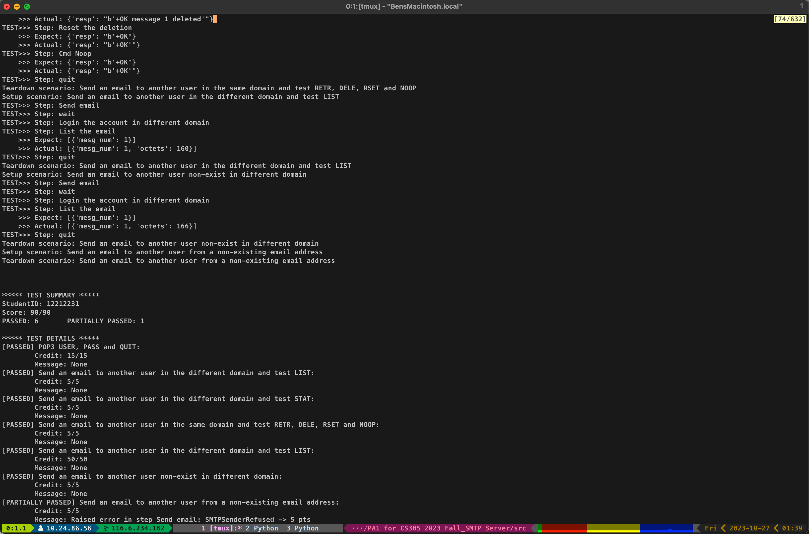

SMTP 抓包结果（基于`4.yml`测试）

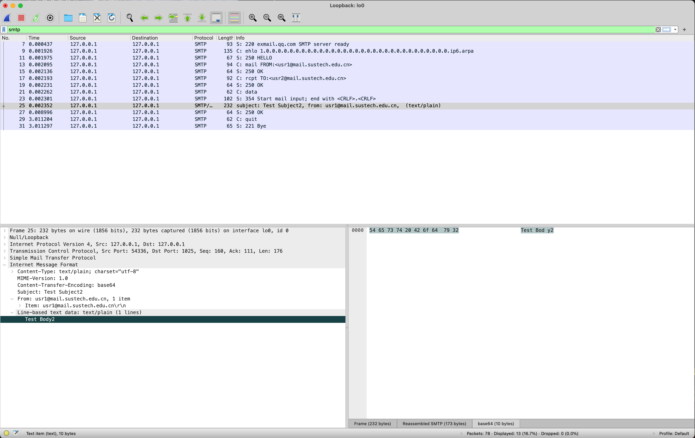

POP 抓包结果（基于`4.yml`测试）

## Bonus Part 1 Email Exchange

> Partner: 陈明志 12211414
> His IP: 10.27.95.59
> My IP: 10.27.96.208
> 对方运行`exmail.qq.com`，并登陆`usr1@mail.sustech.edu.cn`   我方运行`gmail.com`，并登陆`usr1@gmail.com`

### Scenerio 1: 对方给我方发送邮件

对方命令运行结果

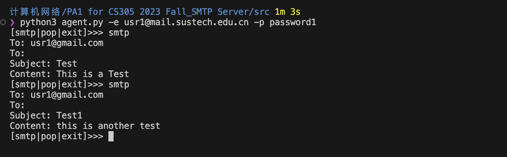

我方抓包结果

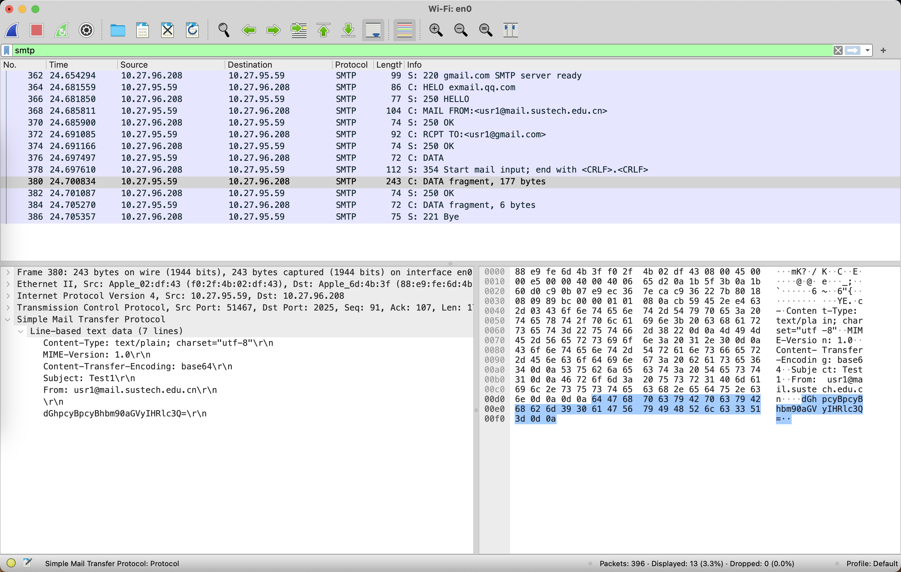

我方服务器收到邮件

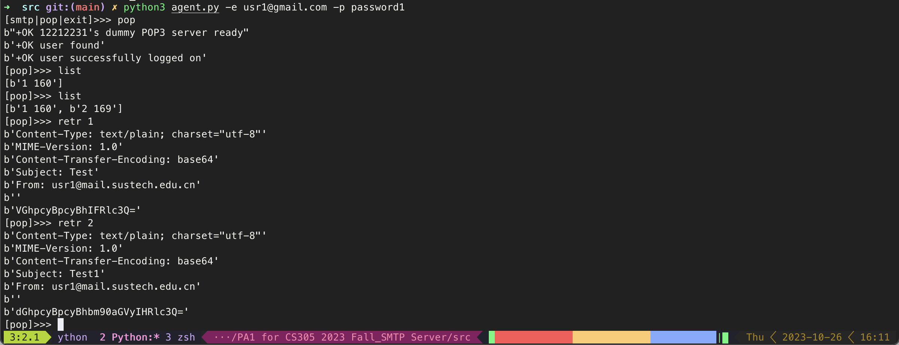

### Scenario 2: 我方给对方发送邮件

我方命令运行结果

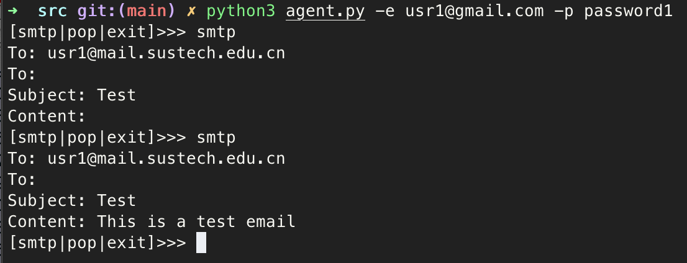

我方抓包结果（本地回环）

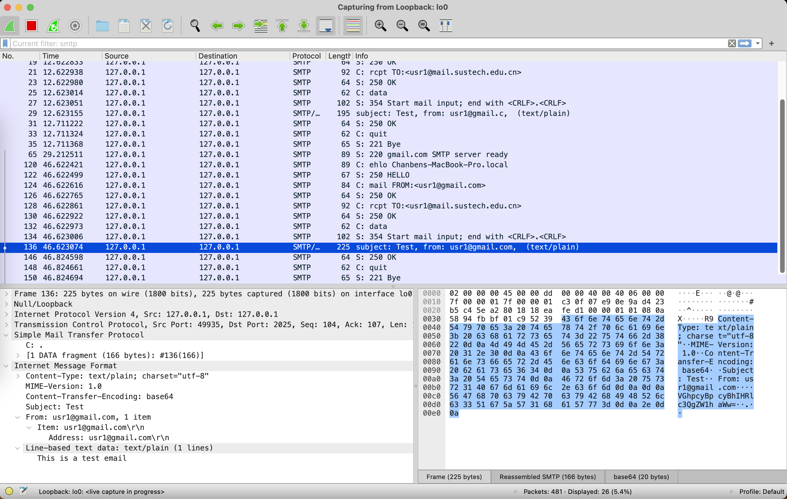

对方agent接收结果

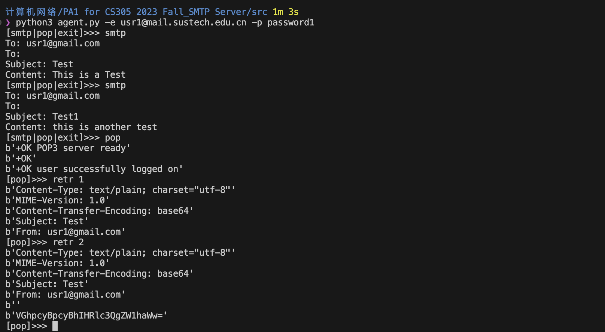

对方抓包结果

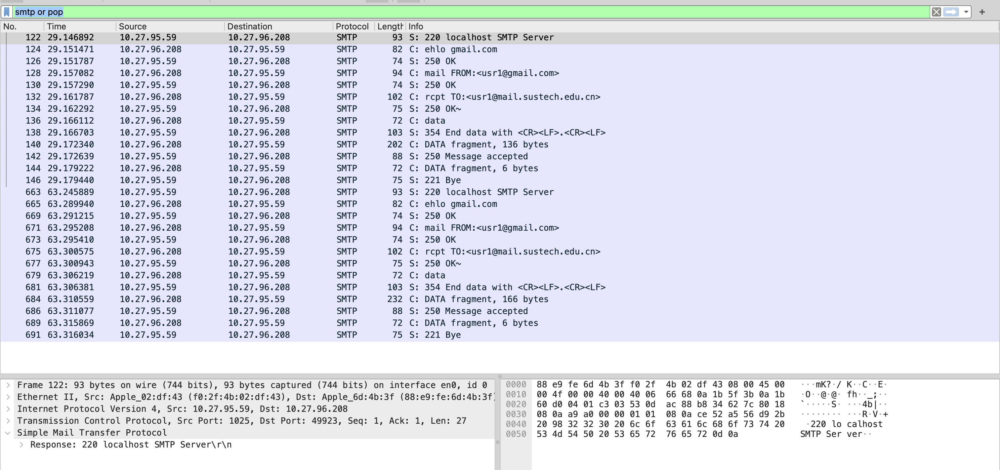

## Bonus Part 2 Error Handling

### Error Part 1: POP Server

设计思路：POP Server主要有三种状态，登陆->处理->退出，且都为单向状态转移。故只需少许状态变量即可表示当前状态。

**Error 1 登陆失败**

`USER` 命令首先检查用户是否存在，若存在，保存用户名并返回`+OK`；若不存在返回`-ERR`。

`PASS` 命令首先检查是否执行过`USER`命令，若未执行，报错并后续不执行。接着检查密码是否正确，若错误，返回`-ERR`。

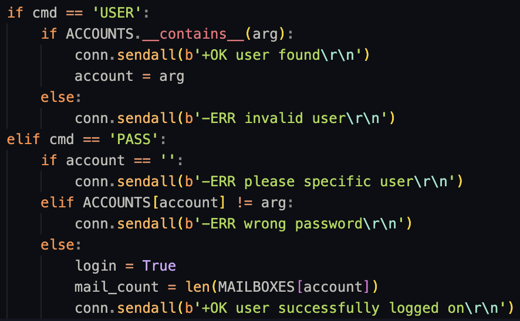

**Error 2 LIST失败**

`LIST x` 首先检查是否登陆，若未登陆后续不执行并返回`-ERR`。然后检查参数是否合法，如在id范围内并且不是已删除邮件，若不合法返回`-ERR`。

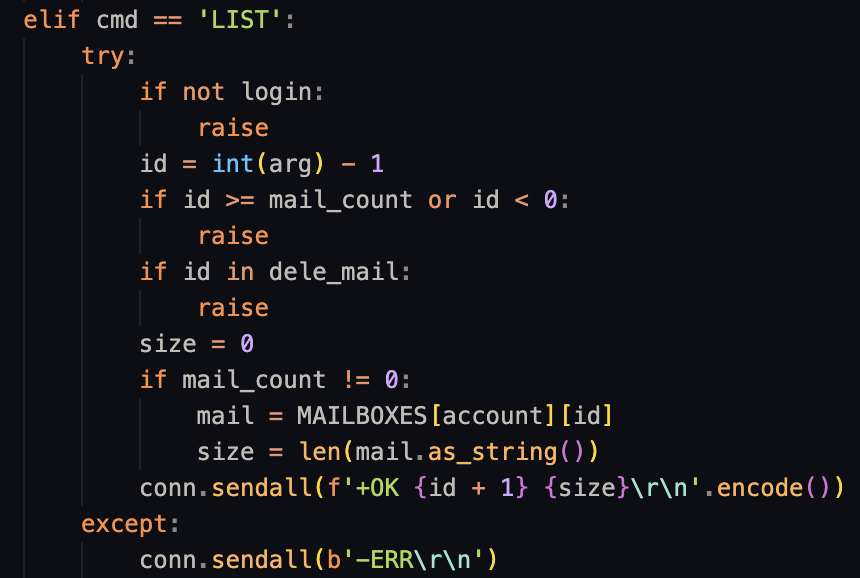

`LISR` 命令只检查是否已登陆，未登陆返回`-ERR`并退出。

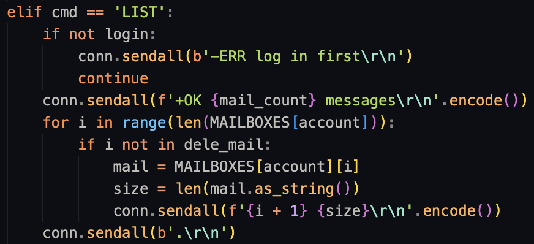

**Error 3 RETR失败**

未登陆和id不合法都会返回`-ERR`并退出

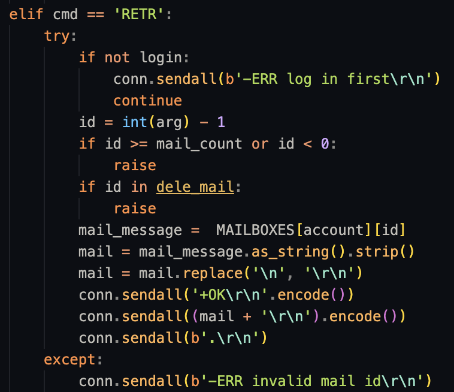

**Error 4 DELE失败**

未登陆和id不合法都会返回`-ERR`并退出

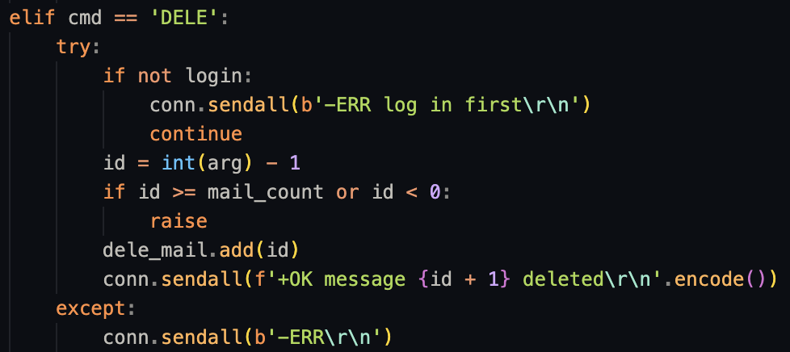

**Error 5 STAT失败**

未登陆时会返回`-ERR`并退出

**Error 6 RSET失败**

未登陆时返回`-ERR`并退出

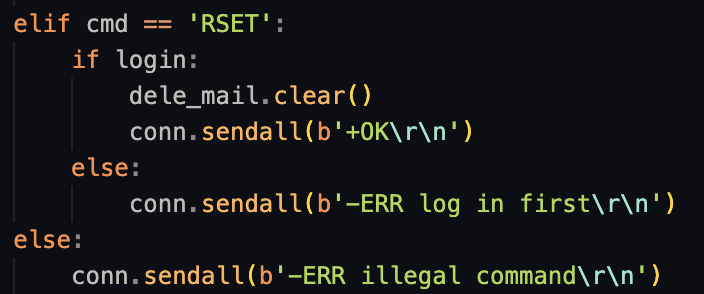

**Error 7 命令不合法**

当命令未实现或不符合标准时，会返回`-ERR`

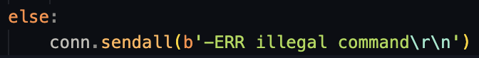

### Error Part 2: SMTP Server

SMTP Server的状态多达五个，但是转换关系并不复杂：登陆->邮件来源->收件人->接收邮件->退出。

**Error 1 登陆失败**

首先验证是否为连接对象是否为邮件Server，具体表现为参数在server配置里。如不是server，只允许本地用户访问，即检查hostname后缀是否为localhost或arpa。

**Error 2 邮件来源失败**

首先验证是否已认证，即HELO命令。接着验证MAIL FROM命令是否执行过，防止多次执行。如果不是server发送的邮件，检查发送方是否合法，防止伪造发件人。

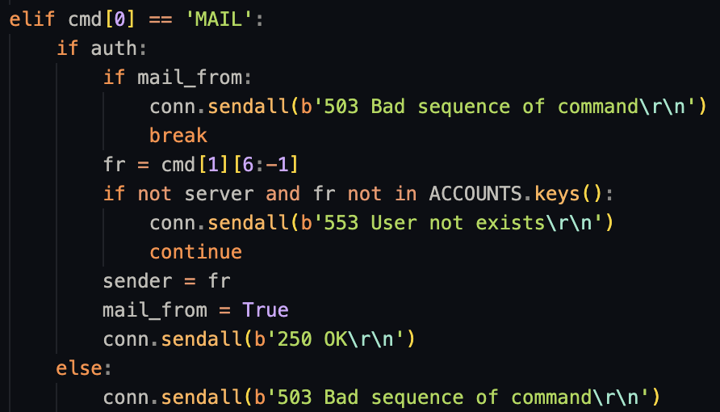

**Error 3 收件人失败**

首先检查邮件是否已发出过，是否已执行MAIL FROM，如已发出或未执行MAIL FROM，返回错误。

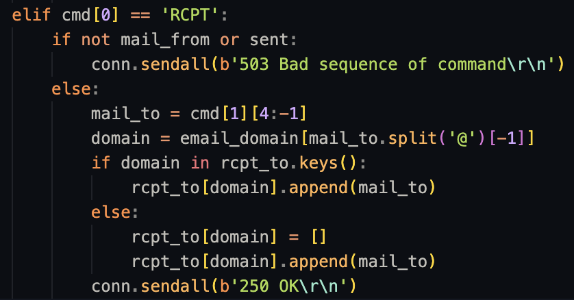

**Error 4 接收邮件失败**

如果前面流程未完成，返回错误并停止接收邮件。

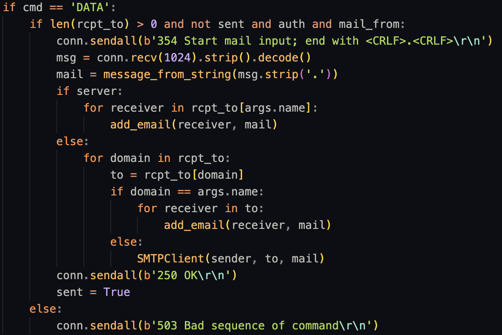

**Error 5 命令不合法**

命令未实现或不合标准，返回错误状态码。

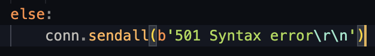
