# Lab Assignment 2

该企业的网络拓扑图为, 其中PC7是外网终端

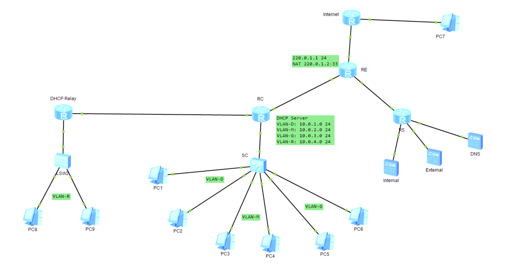

## Part2-1 (10pt)

| Server Name / VLAN Name | Private IP / Subnet Mask | Gateway      | Public IP / Subnet Mask | Static/Dynamic Mapping for NAT/NAPT |
| ----------------------- | ------------------------ | ------------ | ----------------------- | ----------------------------------- |
| VLAN-D                  | 10.0.1.0/24              | 10.0.1.254   | 220.0.1.4-32/24         | Dynamic NAT                         |
| VLAN-M                  | 10.0.2.0/24              | 10.0.2.254   | 220.0.1.33/24           | NAPT                                |
| VLAN-G                  | 10.0.3.0/24              | 10.0.3.254   | 220.0.1.33/24           | NAPT                                |
| VLAN-R (DHCP Relay)     | 10.0.4.0/24              | 10.0.4.252   | /                       | /                                   |
| S-DNS                   | 172.16.1.101/24          | 172.16.1.254 | 220.0.1.2/24            | Static NAT                          |
| S-E                     | 172.16.2.102/24          | 172.16.2.254 | 220.0.1.3/24            | Static NAT                          |
| S-I                     | 172.16.3.103/24          | 172.16.3.254 | /                       | /                                   |

## Part2-2 (50pt)

### DHCP Service

路由器**RC**作为DHCP服务器，与交换机**SC**连接，单臂路由聚合连接，配置如下

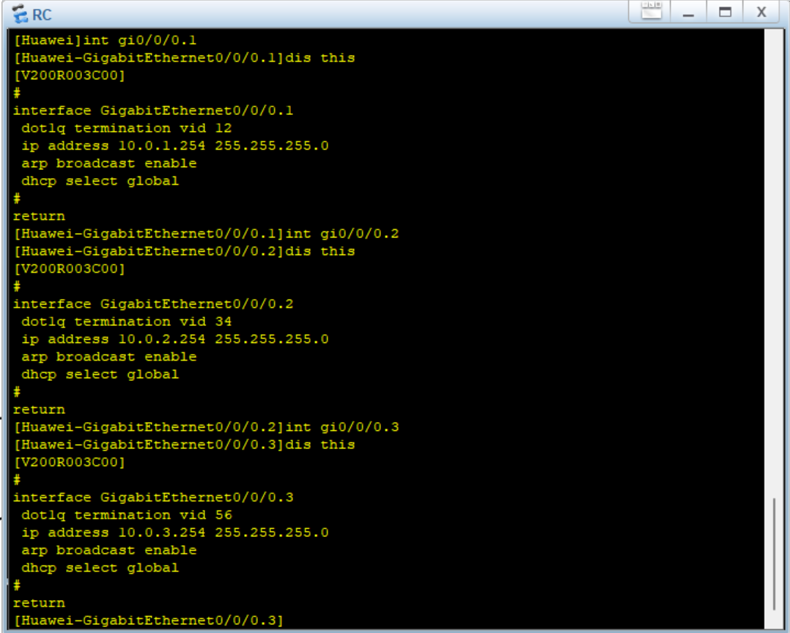

**PC1-6**配置为DHCP Client，通过`ipconfig /renew`向DHCP Server请求

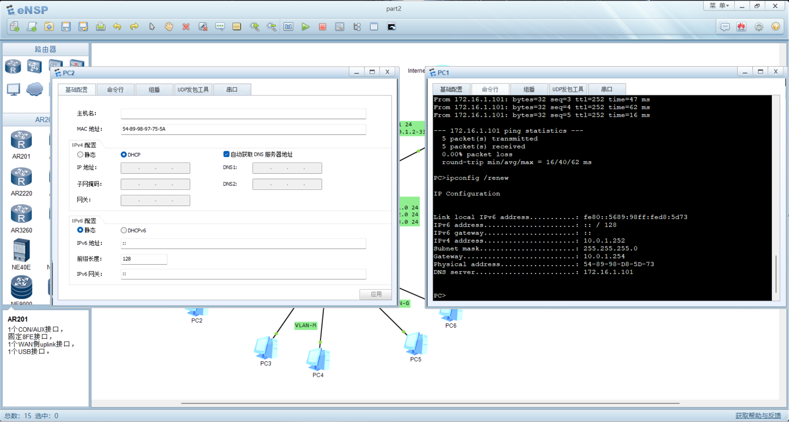

DNS Server的地址也由DHCP自动获取，节省了手动配置的时间。

### VLAN

VLAN在SC中创建，并分配到对应的物理接口，其中PC1和PC2属于VLAN-D, PC3和PC4属于VLAN-M, PC5和PC6属于VLAN-G。

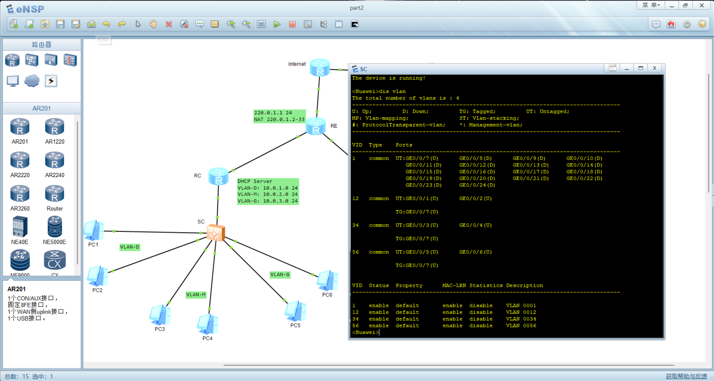

下图为PC1执行`arp -d`后PC1和PC3（不同VLAN）抓包结果，PC3无法接收ARP广播，而同一VLAN内的PC2可以收到。

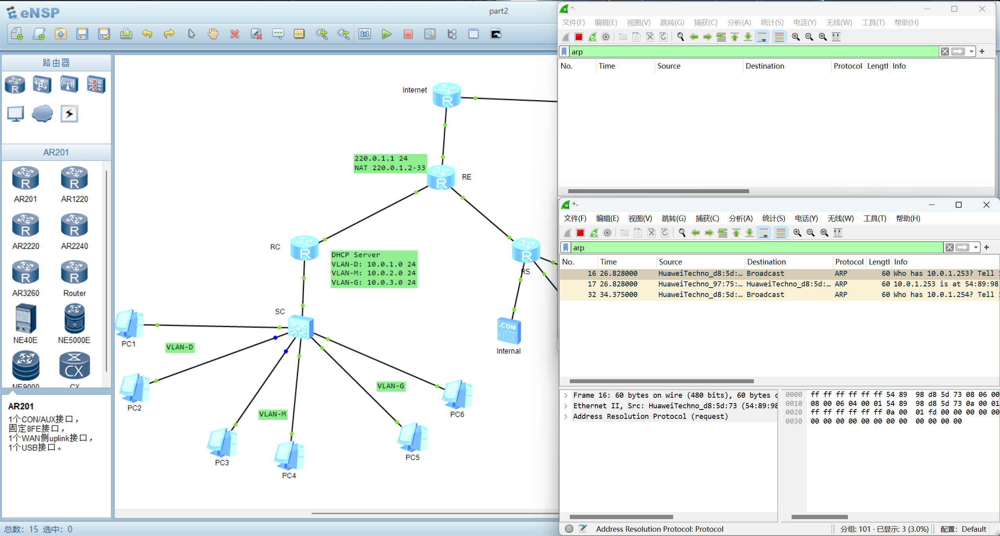

按照要求不同VLAN不能互通，但由于不同VLAN的Network ID不同，终端属于不同子网，交换机会转发报文。因此不做任何配置的情况下，不同VLAN是可以互通的，需要进行使用`acl`访问控制。下图为联通性测试。

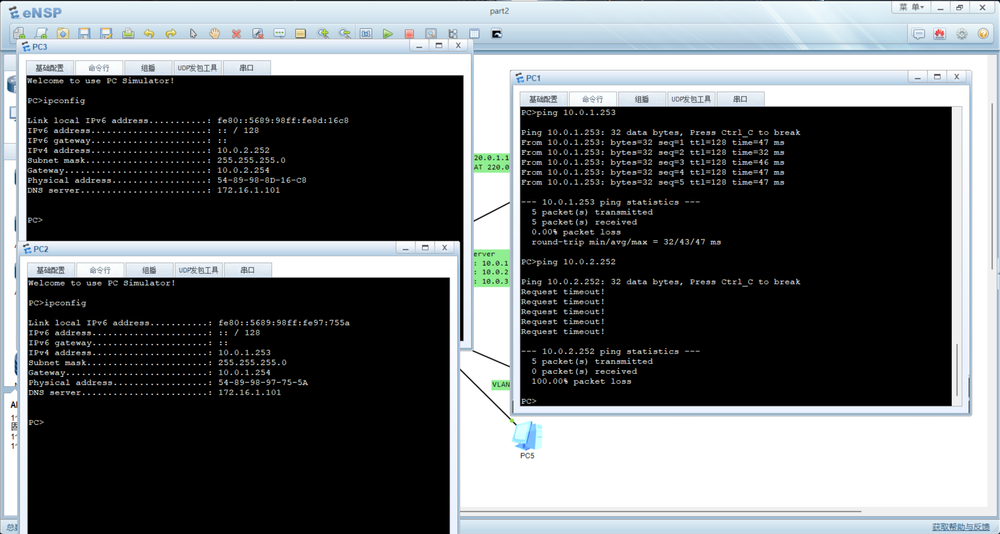

### NAT/NAPT Static/Dynamic

NAT配置和PC7（外网终端）的抓包结果如下图所示

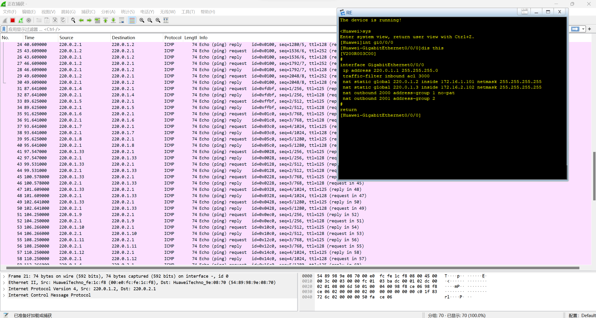

外部终端可以直接通过Static NAT访问**SE**, 而不能访问采用NAPT和Dynamic NAT的Clients

### ACL1 & 2

**RS**和**RE**的配置如下图所示。RS在与Internal Server相连的接口做outbound限制，只允许来自VLAN-D和VLAN-M的IP出口。RE在连接外网的接口做inbound限制，禁止一切发向Internal Server的报文。由于DNS Server没有做NAT，因此外部无法访问，同时RE默认禁止一切目标为内网IP的报文发送。

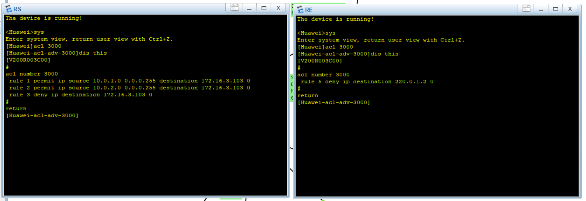

内网Clients能正常访问DNS服务器，并正常解析。其中`internal.com`解析为Internal Server的IP地址。如图所示，PC1（VLAN-D）和PC3（VLAN-M）能访问Internal Server，PC5（VLAN-G）不能访问。

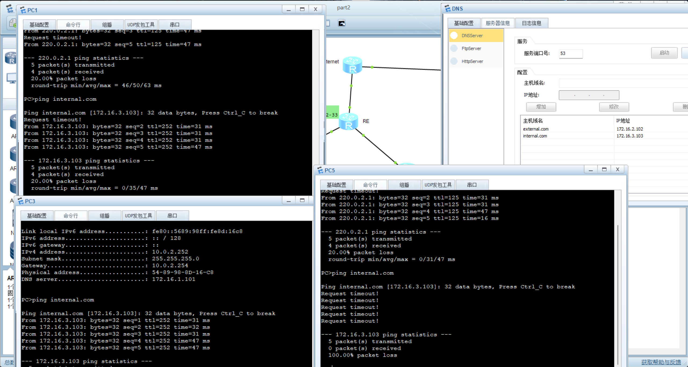

下图为PC1（VLAN-D）和PC3（VLAN-M）访问Internal Server的抓包结果，正常访问

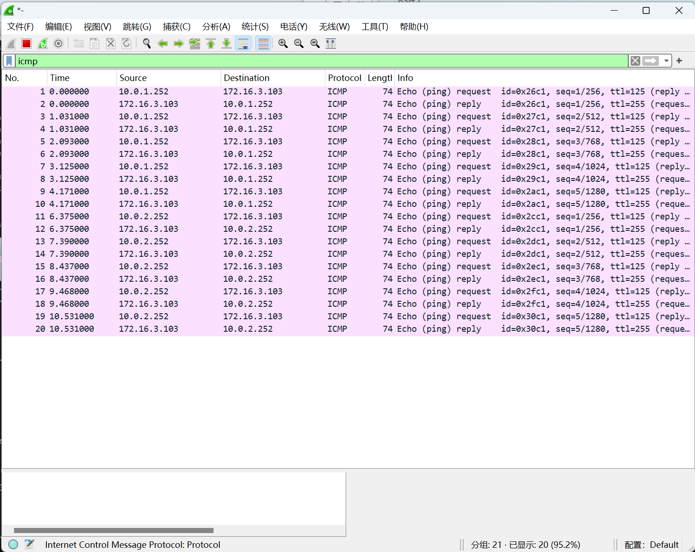

外网Client可以通过Static NAT地址访问External Server，但不能访问Internal Server。

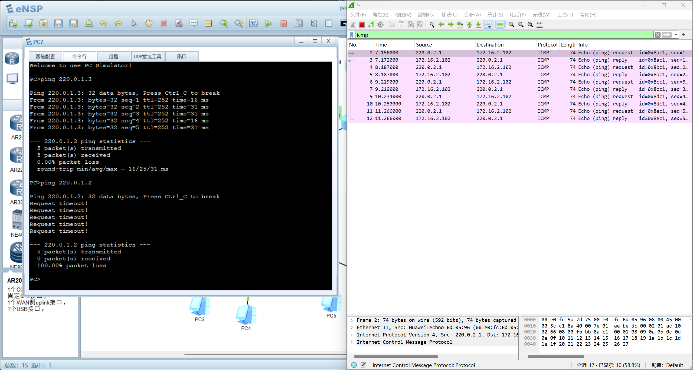

## Part2-3 (20pt)

### VLAN Interflow

从拓扑图可以得知，在RC外增加了一个**Relay**服务器，负责路由**VLAN-R**。VLAN-R由交换机创建，并由于Network ID与其他VLAN都不同，可以正常通信。下图为ping命令测试结果。

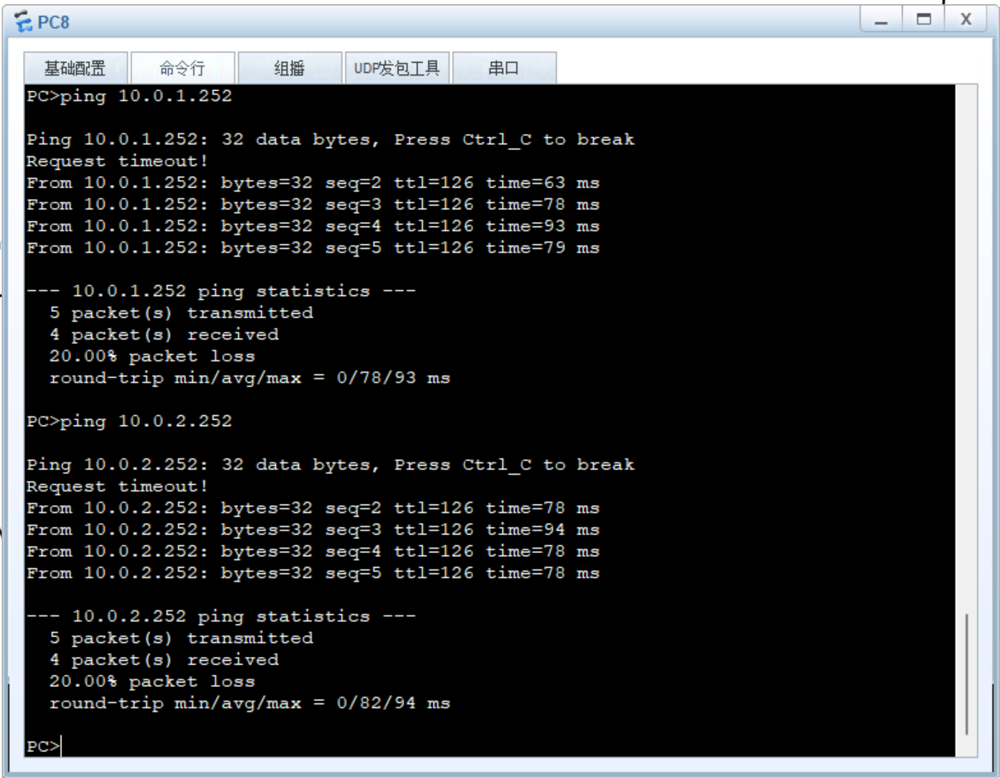

### DHCP Relay

**Relay**服务器作为DHCP中继服务器，负责转发VLAN-R的DHCP请求。具体配置由下图所示

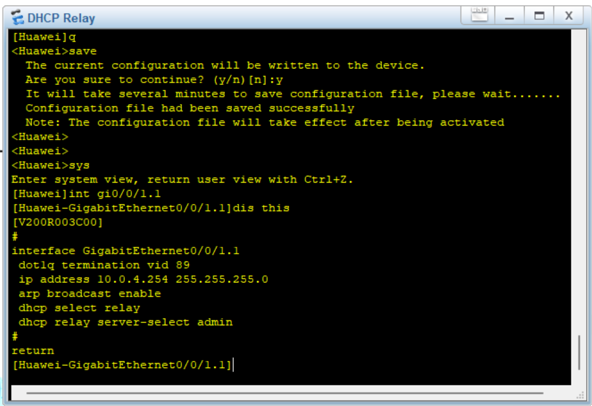

DHCP服务器为**RC**， 已预先分配好IP池，因此Relay服务器只需开启DHCP服务，将与VLAN连接的接口设为relay模式并指定DHCP服务器的IP即可。

### Interflow between RIP & OSPF

拓扑图的左半边（RC和Relay）使用OSPF，右半边（RS）使用RIP，因此二者的交流需要通过中间的RE进行。RE同时打开OSPF和RIP，并在二者的配置中加入`import-route`命令，使二者路由信息进行交换。图中类型为`O_ASE`的项即为外部引入的路由。

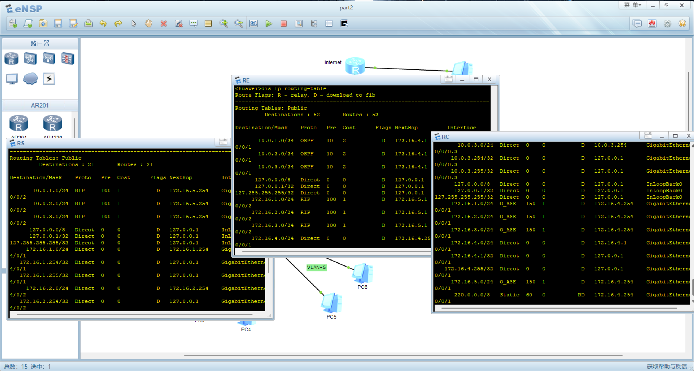

### Telnet

由于PC上没有telnet程序，只能通过路由器远程控制其他路由器。结果如下图所示，将RC的认证模式打开并设置密码，即可通过RE和其他路由器在User View下通过telnet连接RC。RE的console中显示的是RC的信息。

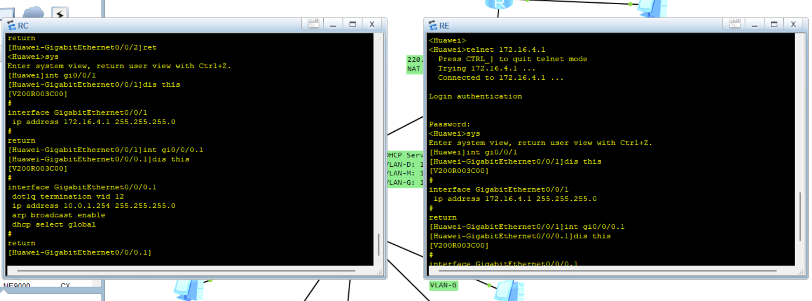

