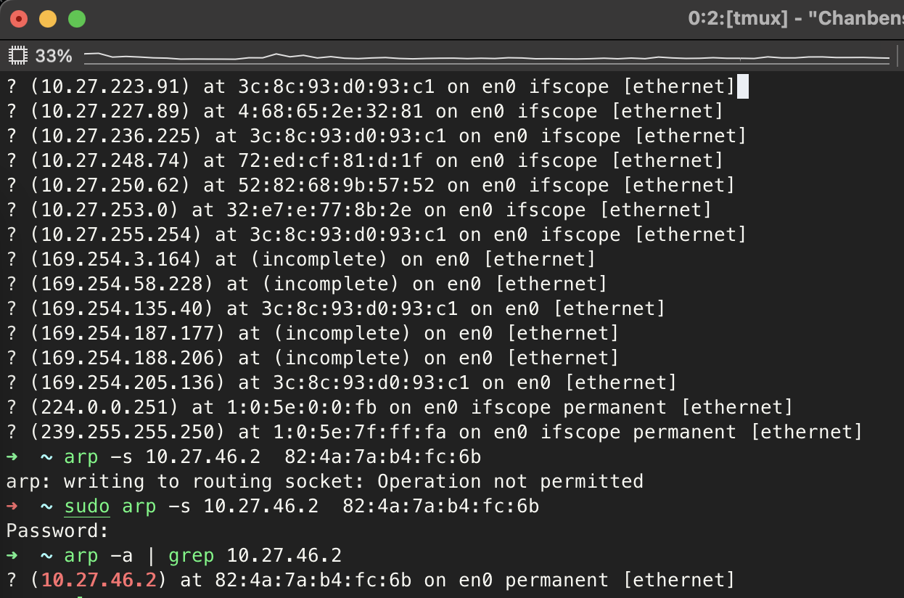
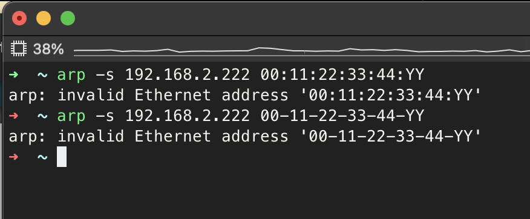
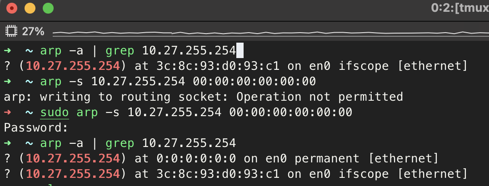
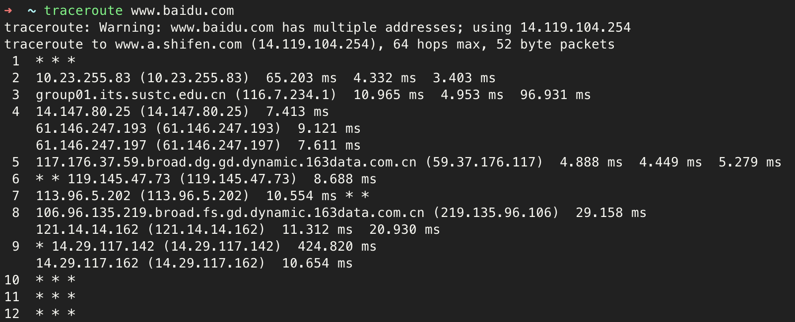
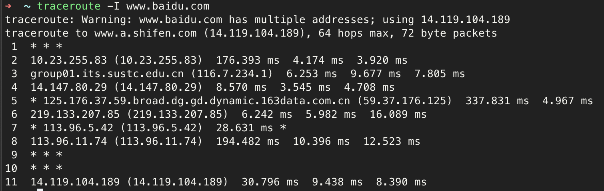

# Practise 1.2

`arp -a`

`arp -s`

`arp -s 192.168.2.222 00:11:22:33:44:YY`

**Q**: could this mapping between two address be added to ARP cache? Why?

**A**: No, because at the end of the mac address `YY` is not valid as a hex number

**Q**: In the following picture, “192.168.2.104” is the IP address of a wirelesscard, “192.168.2.1” is its default gateway, could this arp item related to “192.168.2.1” be deleted or changed from ARP cache? 

**A**: Yes

# Practise 1.4

**Q**:How many hops are there?

**A**: 9

**Q**:What does each column mean of each row? 

**A**: The first column indicates the ip address of the router. The last three column indicates the latency of receiving the three packets.

**Q**:What does * mean in some row?

**A**:It means my computer didn't receive the respond packet. It is probably because the server disables the ICMP protocol or the connection has latency.

**Q**:Does the result the same with the former? Which hops are same? And which hops are different? Try to speculate possible reasons to these results.

**A**: No. First three hops. Rest of the hops. Because the DNS servers resolves the hostname differently. So the ip address of target servers differ and the route to them differs.

**Q**:Are the first hops the same in these two results? 

**A**:Yes.

**Q**:Are the destination hops the same in these two results? 

**A**:No.
