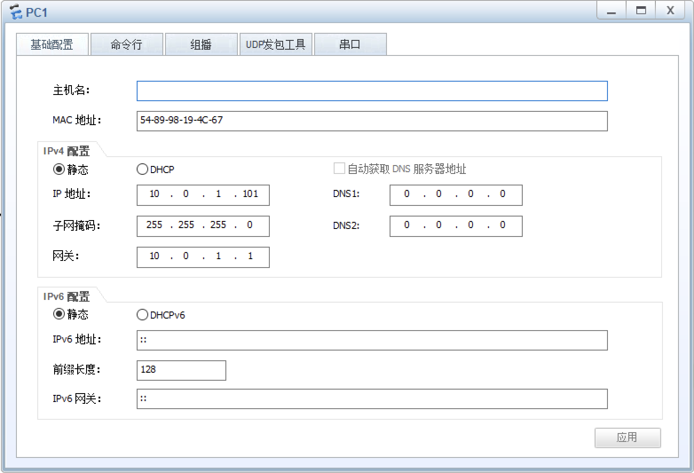
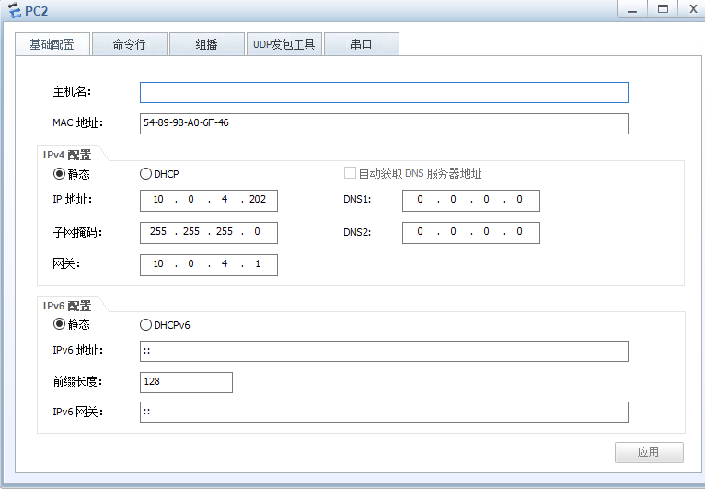
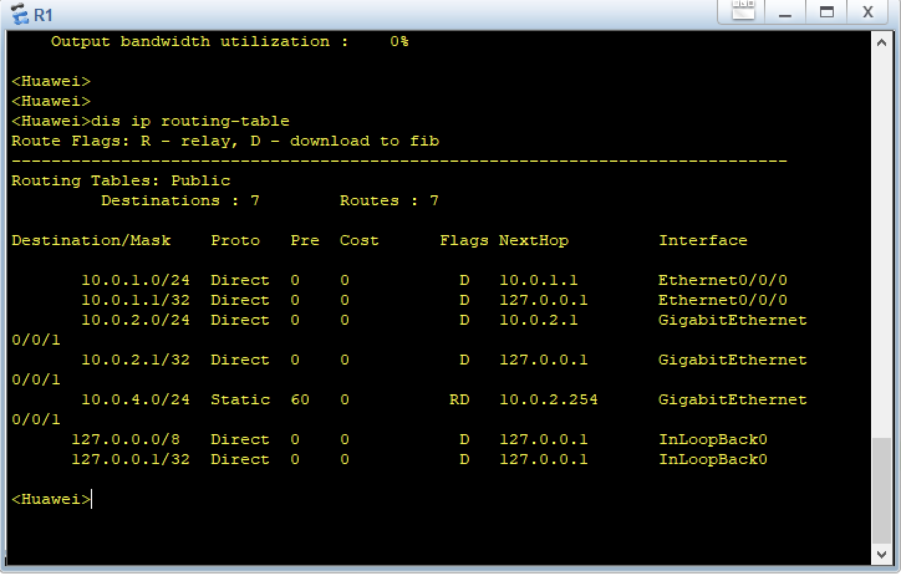
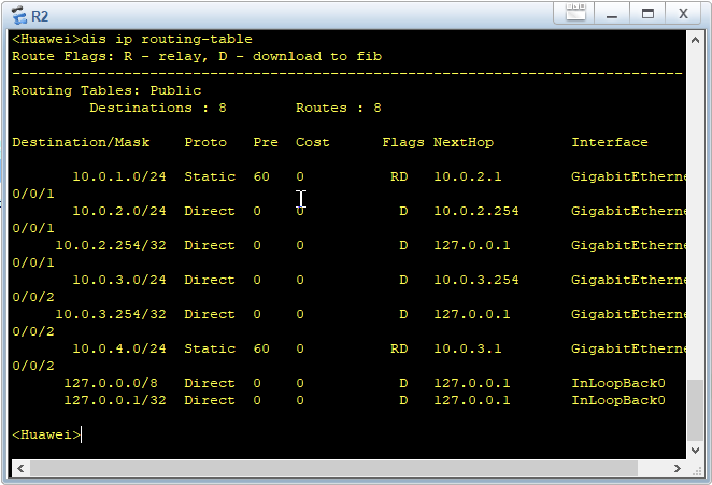
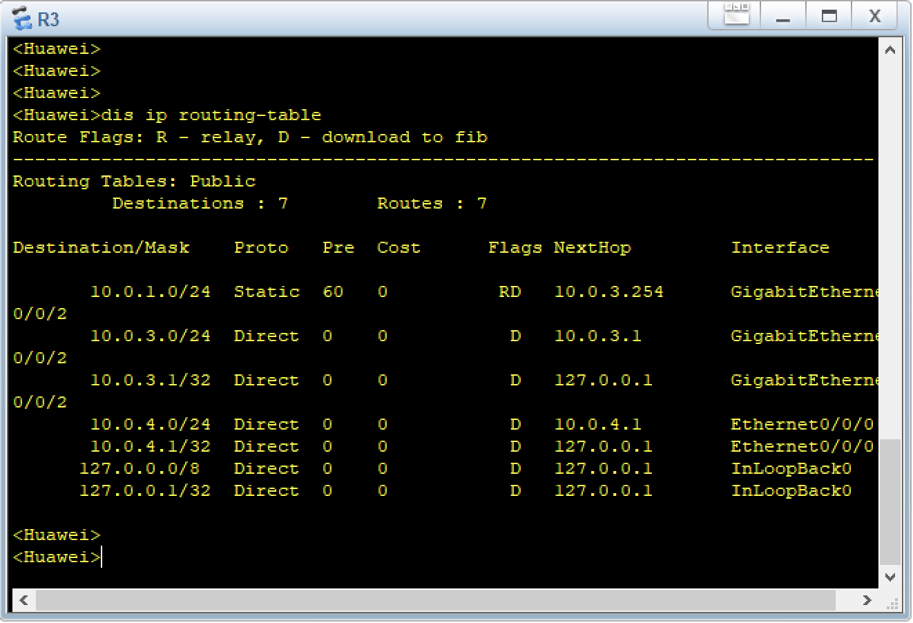
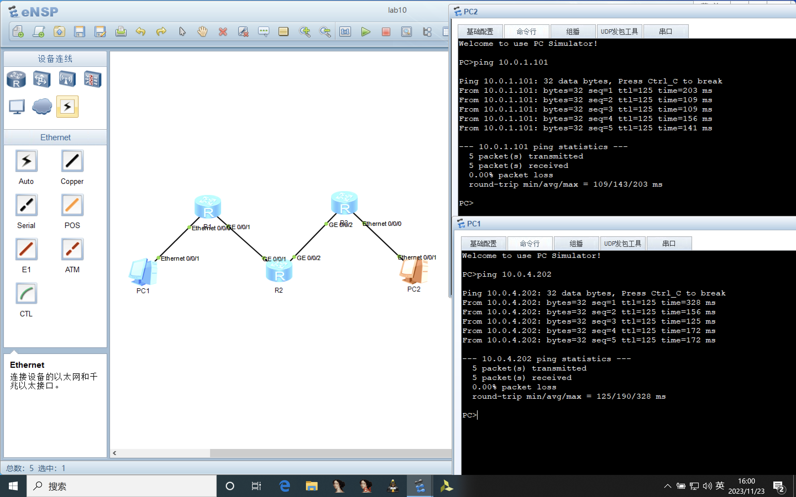
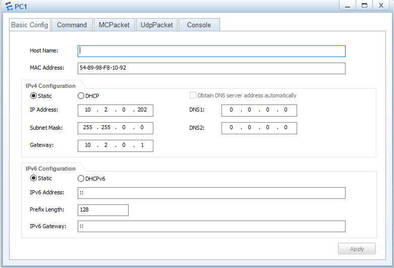
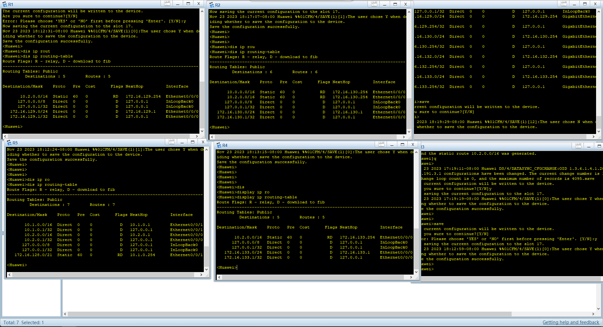
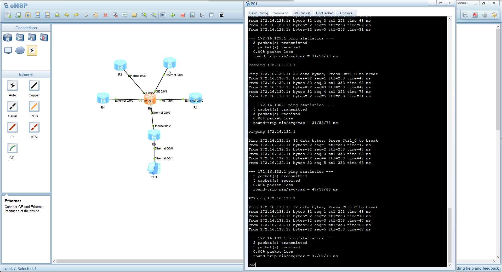

# Practice 10.1

### PC Configuration

- **IP:** `10.0.1.101/24`
- **Gateway:** `10.0.1.1/24`

- **IP:** `10.0.4.202/24`
- **Gateway:** `10.0.4.1/24`

### Routing Tables

**Role:** R1 forwards the packet whose destination is `10.0.4.0/24` to next hop R2 whose address is `10.0.2.254`.

**Role:** R2 forwards the packet whose destination is `10.0.4.0/24` to next hop R3 whose address is `10.0.3.1` and forwards the packet whose destination is `10.0.3.0/24` to next hop R1 whose address is `10.0.2.1`. 

**Role:** R3 forwards the packet whose destination is `10.0.1.0/24` to next hop R2 whose address is `10.0.3.254`.

### Result

# Practice 10.2

### PC Configuration

- **IP:** `10.2.0.202/24`
- **Gateway:** `10.2.0.1/16`

### Routing Table

**R1:** forwards the packet whose destination is `10.2.0.0/16` to next hop **R9** whose address is `172.16.129.254`.

**R2:** forwards the packet whose destination is `10.2.0.0/16` to next hop **R9** whose address is `172.16.130.254`.

**R3:** forwards the packet whose destination is `10.2.0.0/16` to next hop **R9** whose address is `172.16.132.254`.

**R4:** forwards the packet whose destination is `10.2.0.0/16` to next hop **R9** whose address is `172.16.133.254`.

**R5:** forwards the packet whose destination is `172.16.128.0/21` to next hop **R9** whose address is `10.1.0.254`.

**R9:** forwards the packet whose destination is `10.2.0.0/16` to next hop **R5** whose address is `10.2.0.1` and forwards the packet whose destination is `172.16.128.0/21` to next hop **R1/R2/R3/R4** whose address is `172.16.128.254/21`.

**Q:** Is there any route aggregation?

**A:** Yes. The routing table of *R5* indicates that *R1/R2/R3/R4* are in the same subnet `172.16.128.0/21`.

**Q:** Is there any default router in the routes?

**A:** Yes. The routing table of *R9* shows the traffic to the subnets of `172.16.128.0/21` will ne sent to the corresponding routers `172.16.128.254/21` by default.

### Result

