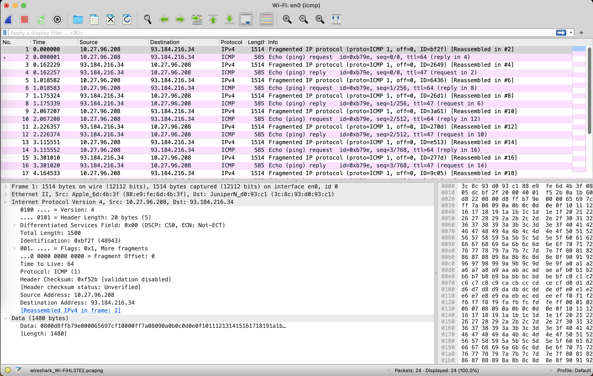
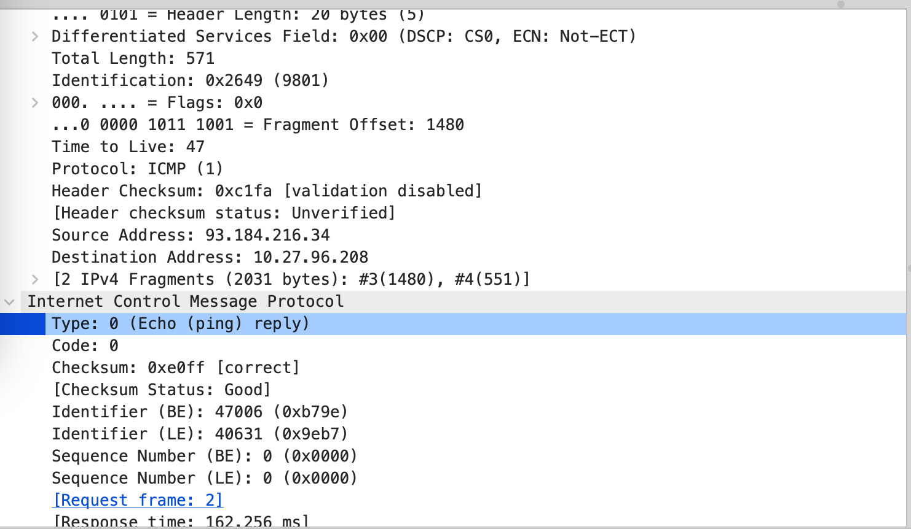

# Practice 11.1

**Q:** How to initiates an ICMP Echo request with 2023Blength?

**A:** `ping www.example.com -s 2023` (UNIX)

**Q:** Is there any fragmentation on the IP packets, how to find them?

**A:** Yes. By the `More Fragments` flag.

**Q:** How many fragments are the 2023-Byte-length IP packet divided into?

**A:** 2 fragments.

**Q:** How to identify the ICMP Echo request and Echo reply?

**A:** By the `Type` field, `0` for **reply** and `8` for **request**.

**Q:** For the ICMP Echo request, which fragment is the first one, which is the last ? How to identify them?

**A:** The first fragment has a offset of zero. The last fragment has `More Fragments` to be zero.

**Q:** What’s the length of each IP fragment? Is the sum of each fragment’s length equal to the original IP packet ?

**A:** One with 1500 bytes and the other with 571 bytes. Yes.

# Practice 11.2

