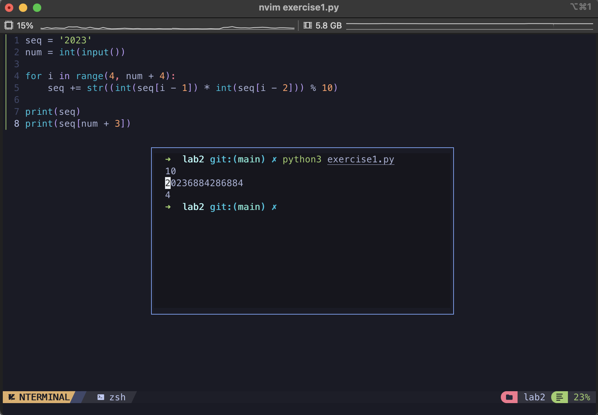
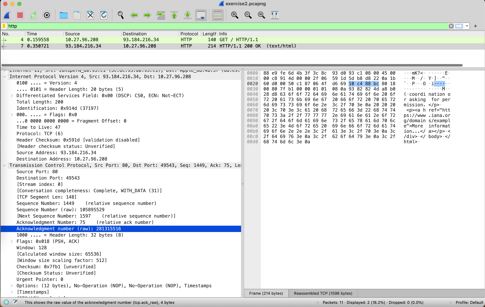
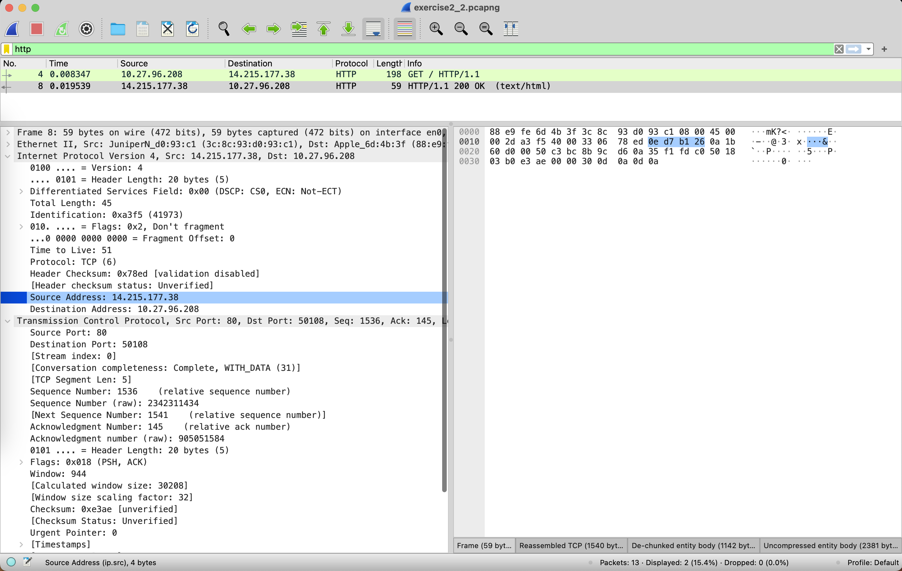

# Practise 2.1

```python
seq = '2023'
num = int(input())

for i in range(4, num + 4):
    seq += str((int(seq[i - 1]) * int(seq[i - 2])) % 10)

print(seq)
print(seq[num + 3])
```

Result:



# Practise 2.2

Capture Filter: `host www.example.com`，Interface: `WIFI en0`

Display Filter: `http`



Decimal: 

- Source IP:`93.184.216.34`
- Source Port: `80`
- Destination IP:`10.27.96.208`
- Destination Port: `49543`

Hexadecimal: 

- Source IP:`5d b8 d8 22`
- Source Port: `00 50`
- Destination IP:`0a 1b 60 d0`
- Destination Port: `c1 87`

## baidu.com

Code

```python
import requests
url = 'http://www.baidu.com'
req = requests.Session()

res = req.get(url)
print(res.text)
```



Decimal: 

- Source IP:`14.215.177.38`
- Source Port: `80`
- Destination IP:`10.27.96.208`
- Destination Port: `50108`

Hexadecimal:  (Big endian)

- Source IP:`0e d7 b1 26`
- Source Port: `00 50`
- Destination IP:`0a 1b 60 d0`
- Destination Port: `c3 bc`

Same values:

- Source Port 80 (HTTP port)
- Destination IP (My host)
