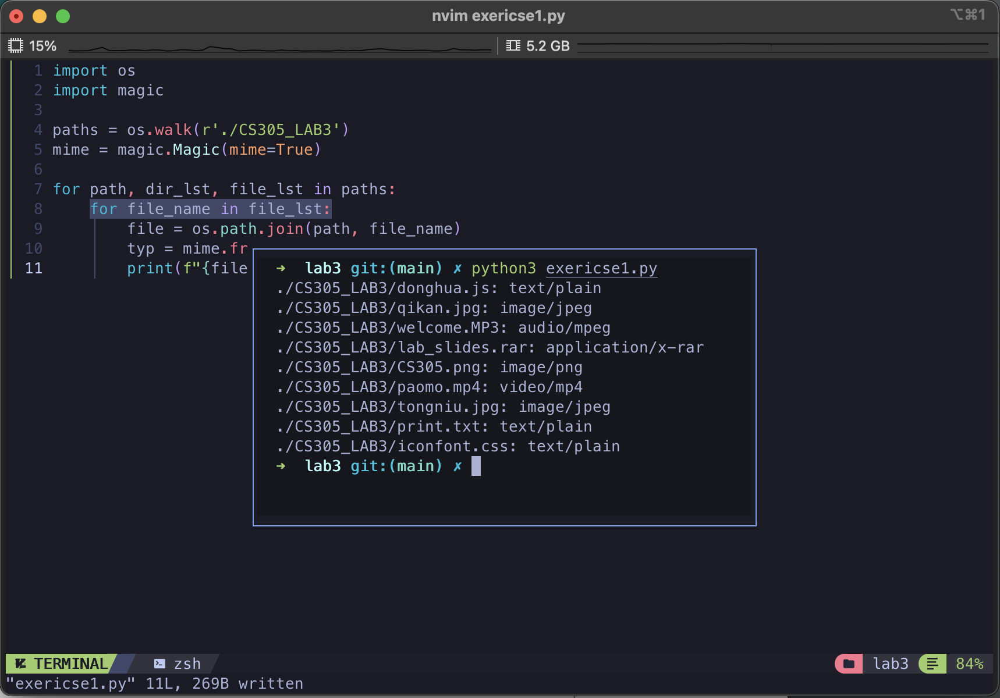
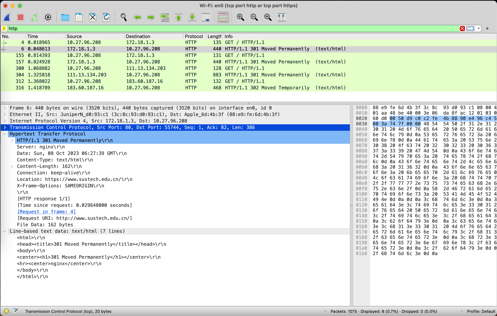
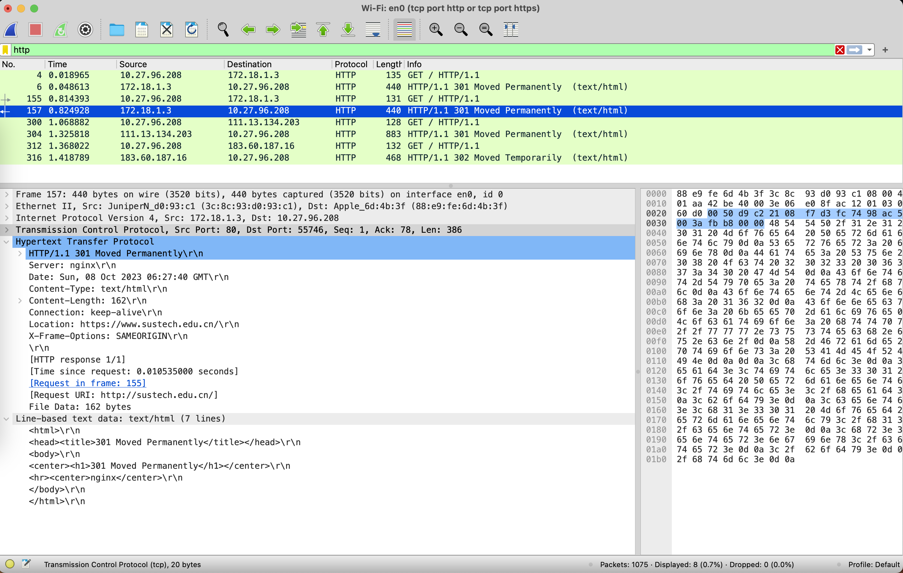
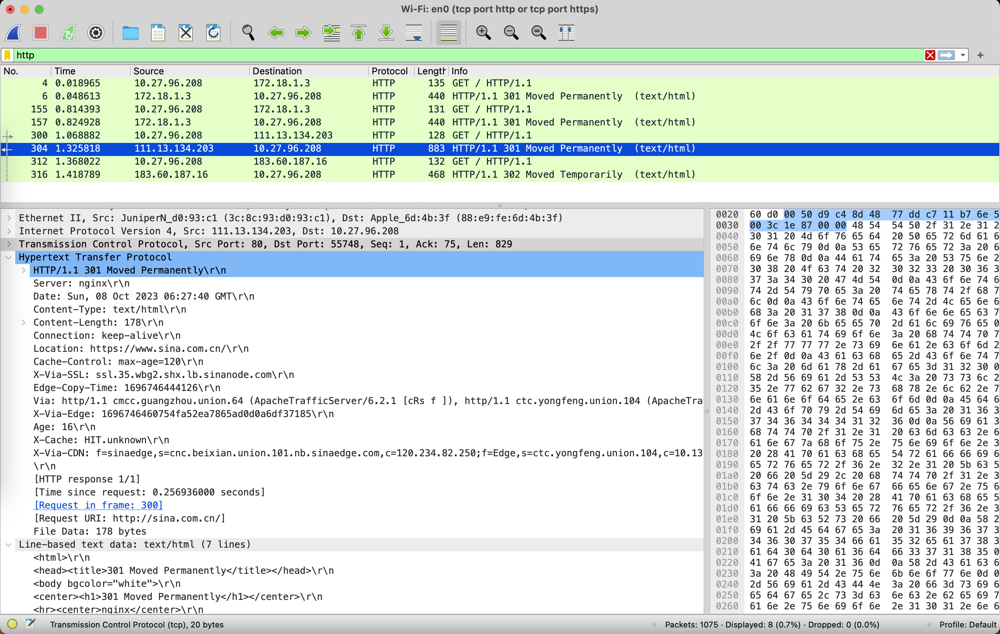
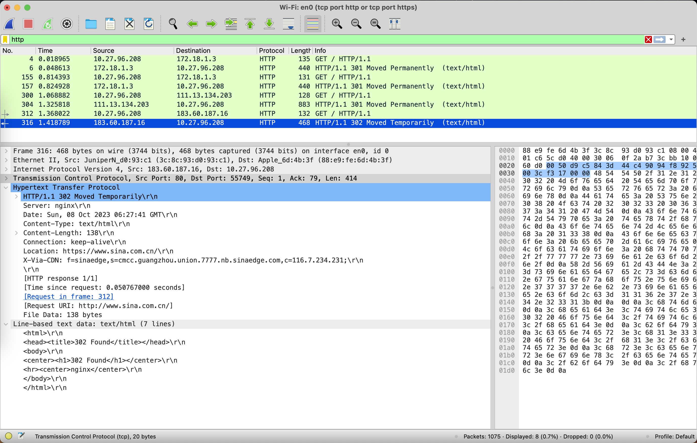
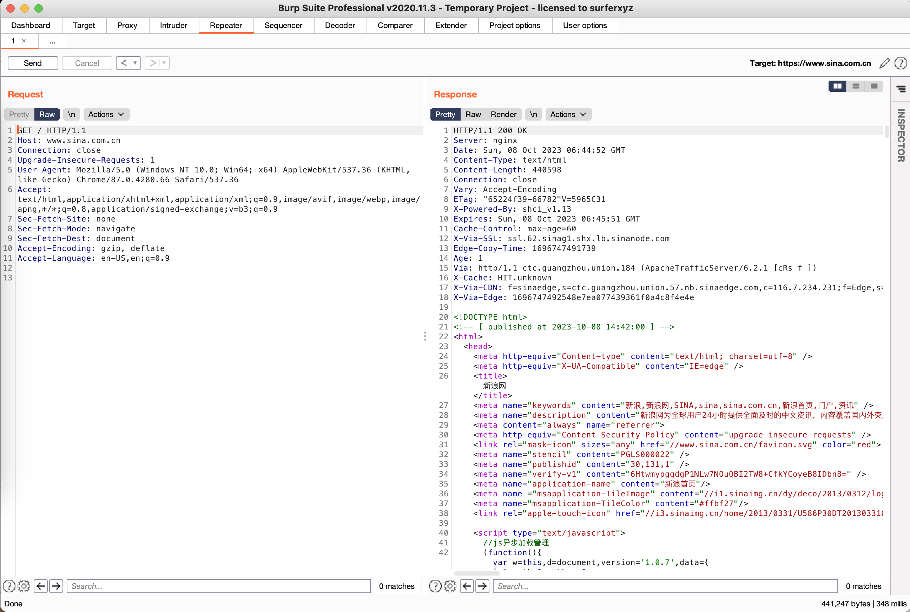
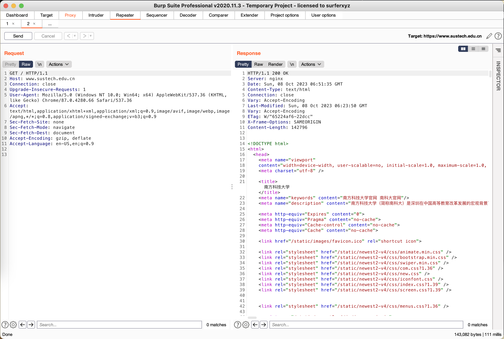
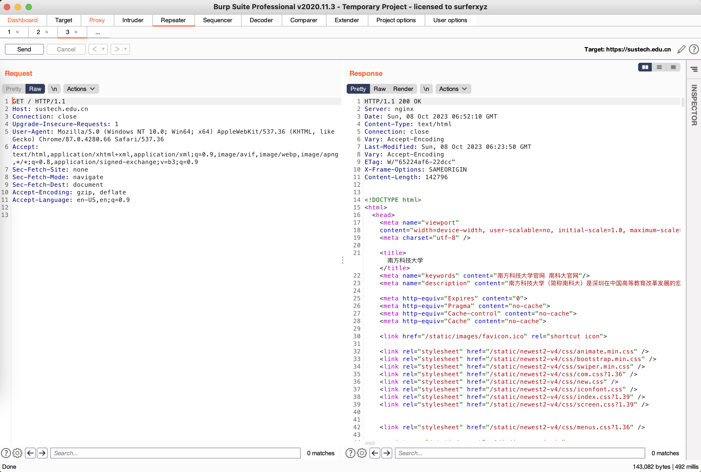
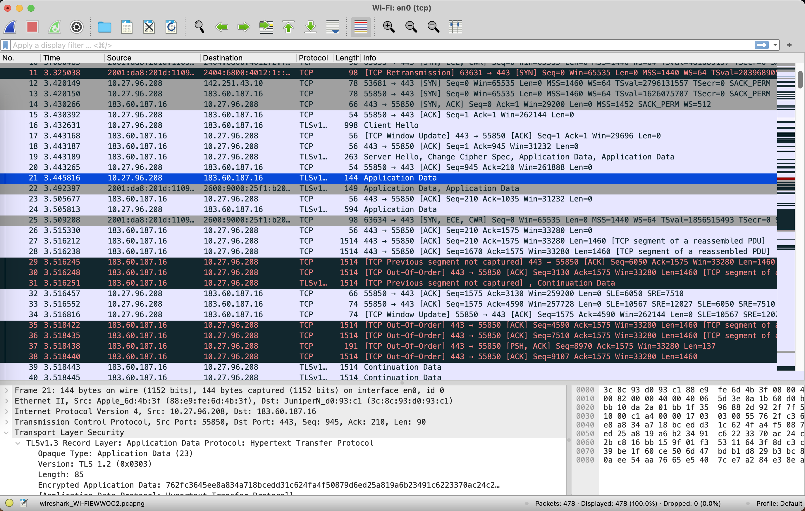

# Practise 3.1

[exercise1.py](./exericse1.py)

```python
import os
import magic

paths = os.walk(r'./CS305_LAB3')
mime = magic.Magic(mime=True)

for path, dir_lst, file_lst in paths:
    for file_name in file_lst:
        file = os.path.join(path, file_name)
        typ = mime.from_file(file)
        print(f"{file}: {typ}")
```

Result:



# Practise 3.2

Environment: 

- Wireshark capture filter `tcp port http` or `tcp port https`
- Wireshark display filter `http`
- curl

[exercise2.sh](./exericse2.sh)

```bash
curl -ipv4 http://www.sustech.edu.cn
curl -ipv4 https://www.sustech.edu.cn
curl -ipv4 http://sustech.edu.cn
curl -ipv4 https://sustech.edu.cn
curl -ipv4 http://sina.com.cn
curl -ipv4 http://www.sina.com.cn
curl -ipv4 https://www.sina.com.cn
```


| URL                        | Status                | Port |
| -------------------------- | --------------------- | ---- |
| http://www.sustech.edu.cn  | 301 Moved Permanently | 80   |
| https://www.sustech.edu.cn | 200 OK                | 443  |
| http://sustech.edu.cn      | 301 Moved Permanently | 80   |
| https://sustech.edu.cn     | 200 OK                | 443  |
| http://sina.com.cn         | 301 Moved Permanently | 80   |
| http://www.sina.com.cn     | 302 Moved Temporarily | 80   |
| https://www.sina.com.cn    | 200 OK                | 443  |

Host: `http://www.sustech.edu.cn`




Host: `http://sustech.edu.cn`




Host: `http://sina.com.cn`




Host: `http://www.sina.com.cn`




Host: `https://www.sina.com.cn`




Host: `https://www.sustech.edu.cn`




Host: `https://sustech.edu.cn`



` Wireshark`


