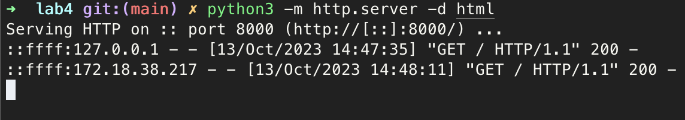
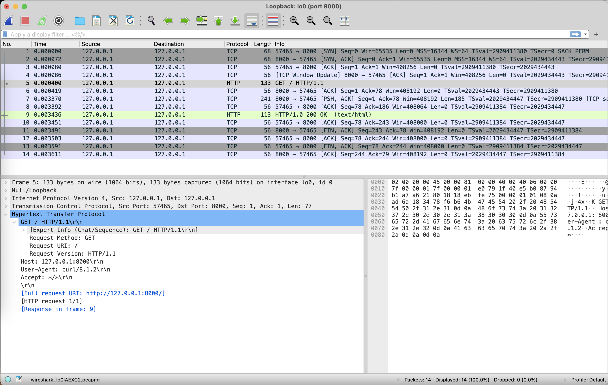
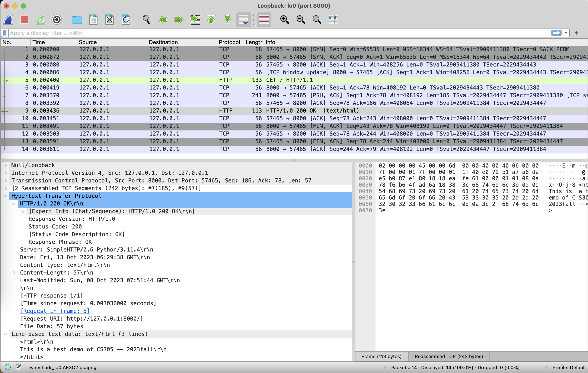
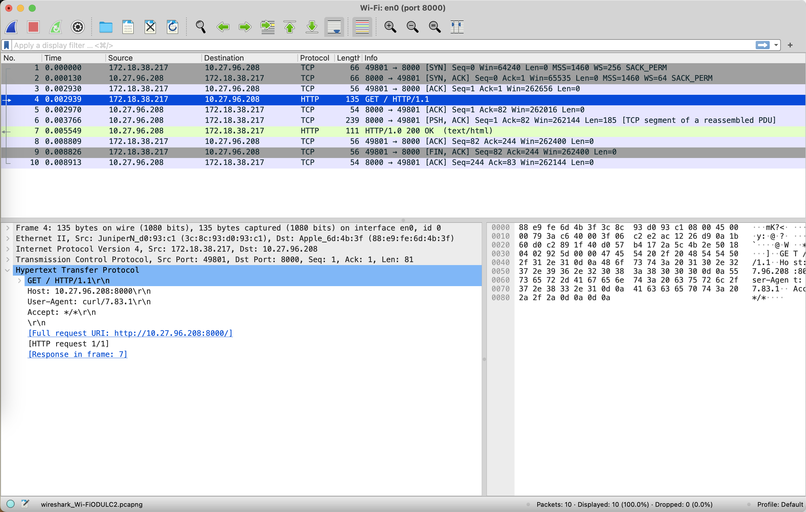
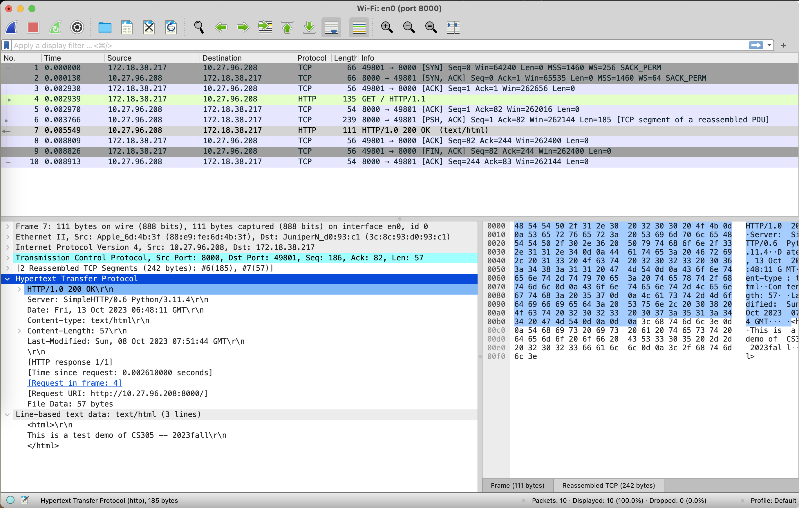
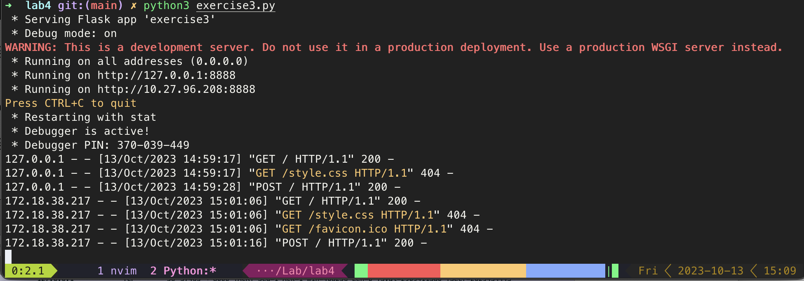
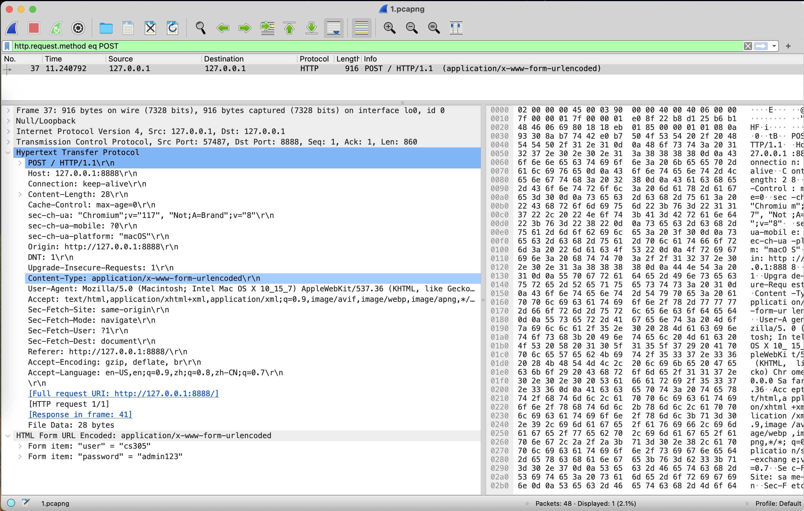
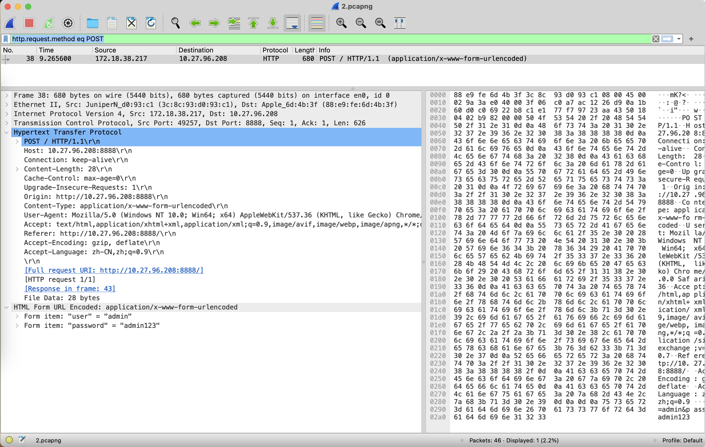

# Practice 4.2

- IP address: `10.27.96.208`
- Command: `python3 -m http.server -d html`



**Q2-1**: When accessing the web server from your own PC, which URL will work, “10.27.96.208:8000” or “127.0.0.1:8000” ?

**A**: Both are working but “127.0.0.1:8000” is recommended.

**Q2-2**: When accessing the web server from your own PC, which interface should you choose?

**A**: Loopback: `lo0`



**HTTP Request**

- Source IP:  `127.0.0.1`
- Source Port:  `57465`
- Destination IP: `127.0.0.1`
- Destination Port: `8000`



**HTTP Response**

- Source IP:  `127.0.0.1`
- Source Port:  `8000`
- Destination IP: `127.0.0.1`
- Source Port:  `57465`
- Status Code: `200 OK`

**Q2-3**: Let your classmate to access your web server, which URL will work, “10.27.96.208:8000” or “127.0.0.1:8000” ?

**A**: 10.27.96.208:8000

**Q2-4**: Let your classmate to access your web server, which interface should you choose?

**A**: WiFi: `en0`



**HTTP Request**

- Source IP:  `172.18.38.217`
- Source Port:  `49801`
- Destination IP: `10.27.96.208`
- Destination Port: `8000`



**HTTP Response**

- Source IP:  `10.27.96.208`
- Source Port:  `8000`
- Destination IP: `172.18.38.217`
- Destination Port: `49801`
- Status Code: `200 OK`

# Practice 4.3

[exercise3.py](./exercise3.py)

```python
from flask import Flask, request, render_template

app = Flask(__name__)

@app.route("/", methods=['GET', 'POST'])
def main():
    if request.method == 'GET':
        return render_template('main.html')
    if request.method == 'POST':
        user = request.form.get('user')
        password = request.form.get('password')
        res = f'User: {user}\nPassword: {password}'
        return res
    return 'Invalid Method'

if __name__ == '__main__':
    app.run('0.0.0.0', 8888, debug=True)
```



**Q3-1:** When accessing the web server from your own PC, which interface should you choose?

**A:**  Loopback: `lo0`

**Q3-2:** Let your classmate to access your web server, which interface should you choose?

**A**: WiFi: `en0`

**Q:** If we need analyze the packages using POST method, what display filter should be set? Are the packages request messages or response messages?

**A:** Display filter is `http.request.method eq POST`. The packages are request messages because the Method  field is needed only for request header.




