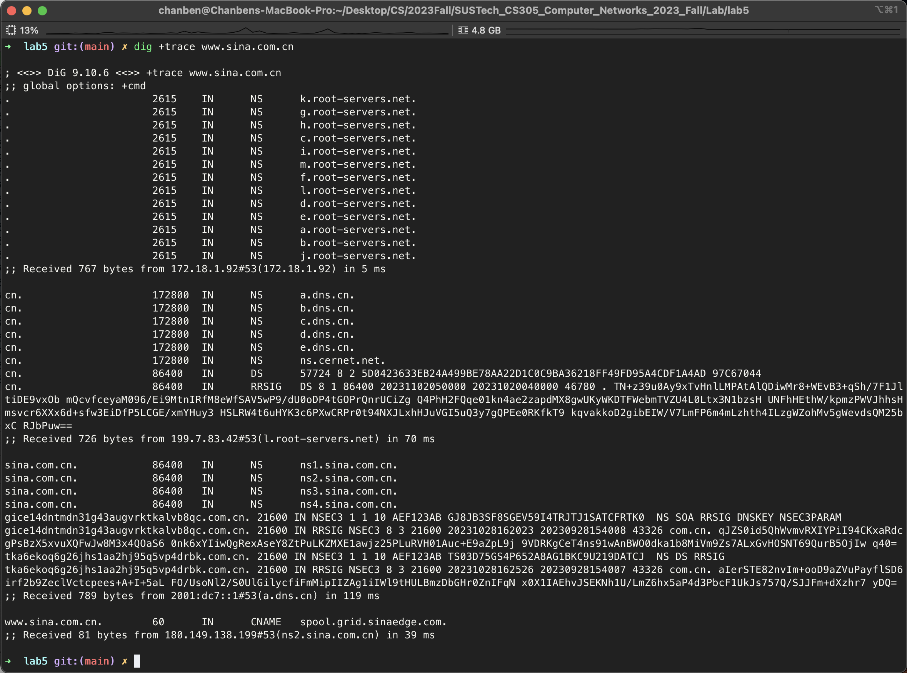
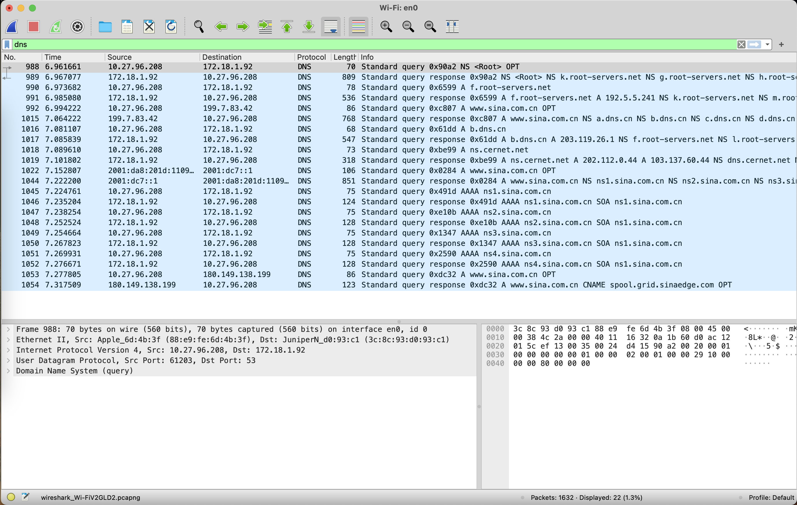
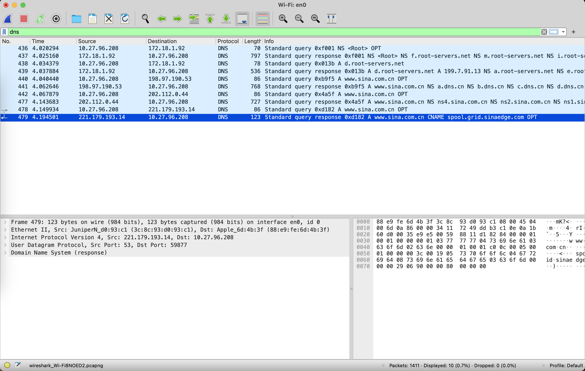
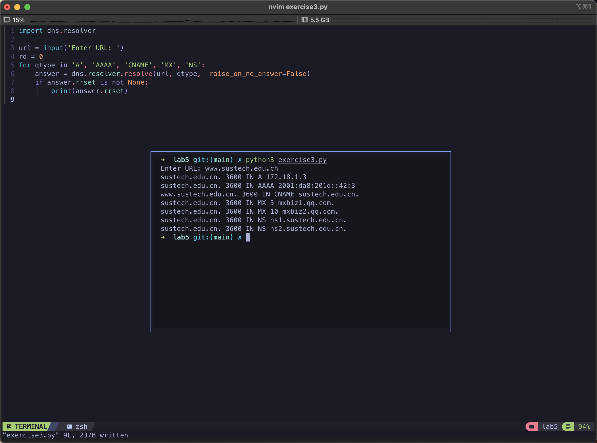
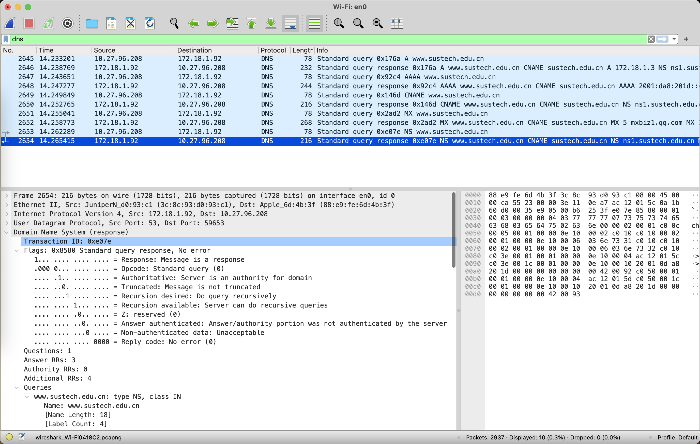
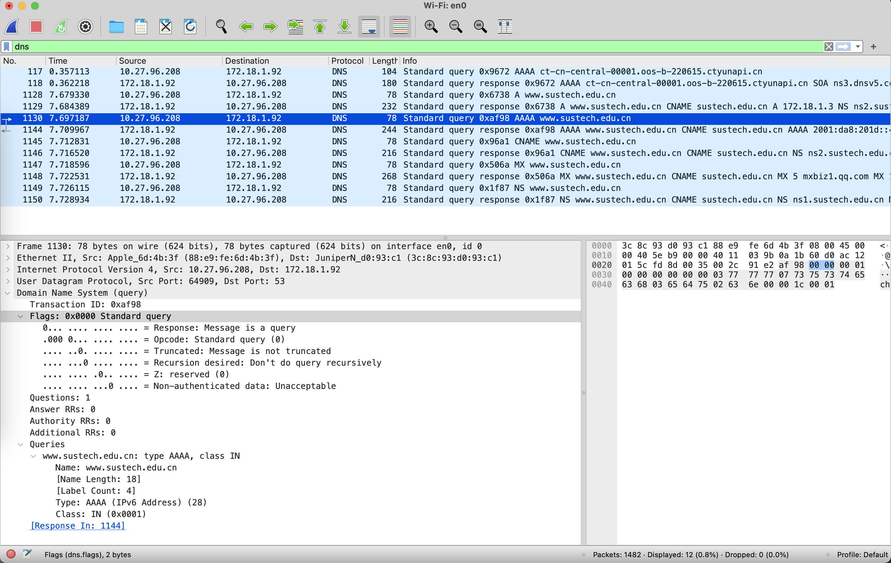

# Practice 5.1





**Q:** How many queries are sent form the local host? Do they share the same “ transaction id”?

**A:** 11 queries with different transaction id.

**Q:** How many responses are received by local host?

**A:** 11 responses. Same number as query's.

**Q:** what's the value of ‘RD' field in query? what's the value of ‘RA' field in response from the local DNS server? 

**A:** RD = 0, RA = 1;

**Q:** which server sent the the last response, is it the local DNS server of the local host or is it the Authoritative DNS server? 

**A:** `ns4.sina.com.cn` the Authoritative DNS server.



**Q:** Try the same query again. At this time, is the last response from the same server as the last response in the previous query? If they are different, what is the reason for this? will it bring any benefits?

**A:** Different server. Because the computer choose the NS record randomly. It may relieve the presure of dns server.

# Practice 5.3

```python
import dns.resolver

resolver = dns.resolver.Resolver()
resolver.flags = 0x0000 # 0x0100
dns.resolver.default_resolver = resolver
url = input('Enter URL: ')
rd = 0
for qtype in 'A', 'AAAA', 'CNAME', 'MX', 'NS':
    answer = dns.resolver.resolve(url, qtype,  raise_on_no_answer=False)
    if answer.rrset is not None:
        auth = answer.response.flags & 0b000000010000 != 0
        print(answer.rrset, end=' ')
        if auth:
            print('Authenticated')
        else:
            print('Non-Authenticated')

```







**Q:** Display the answer, check who sends the answer? Whether the answer is from authority Name Server or not? How to judge that?

**A:** By the flag `Answer Authenticated`
