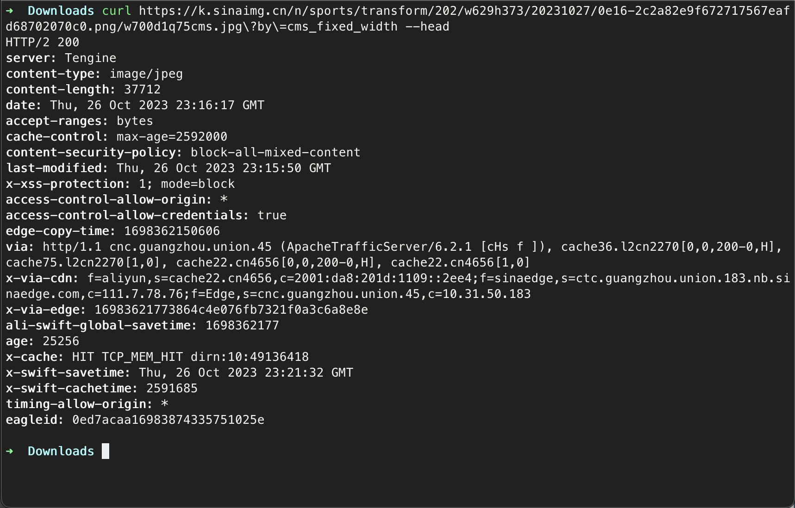
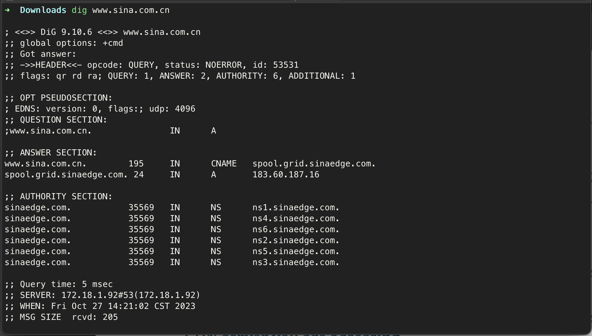
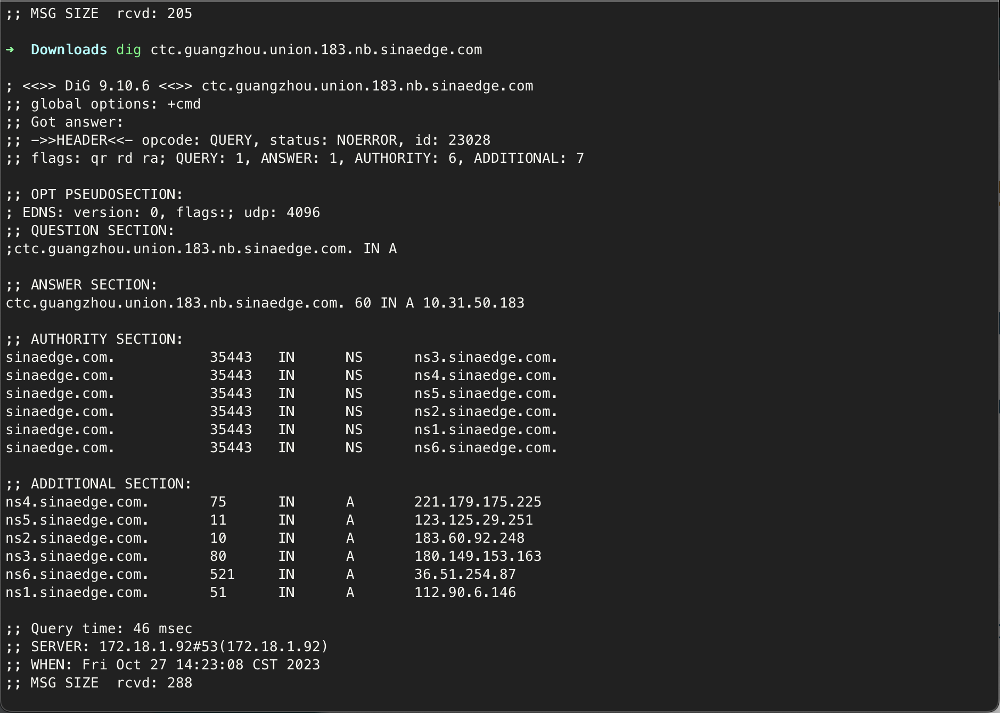
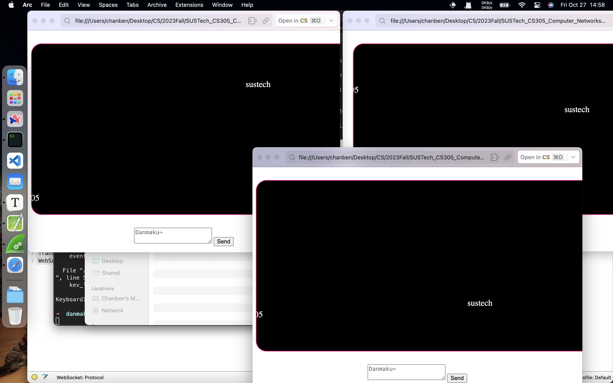

# Practice 6.1



**Q:** From what header field(s) can you tell that this web is using CDN?

**A:** `x-via-cdn`



**Q:** Use nslookup/dig in your computer to find the IP address of this web site.

**A:** IP: 183.60.187.16



**Q:** Use nslookup/dig in your computer to find the IP address of the CDN server you are accessing.

**A: **IP: 10.31.50.183

# Practice 6.2

```python
import asyncio
import websockets


class DanmakuServer:
    def __init__(self):
        self.danmu = ''
        self.clients = []

    async def reply(self, websocket):
        self.clients.append(websocket)
        while True:
            self.danmu = await websocket.recv()
            for socket in self.clients:
                await socket.send(self.danmu)


if __name__ == "__main__":
    server = DanmakuServer()
    asyncio.get_event_loop().run_until_complete(
        websockets.serve(server.reply, 'localhost', 8765))
    asyncio.get_event_loop().run_forever()
```


