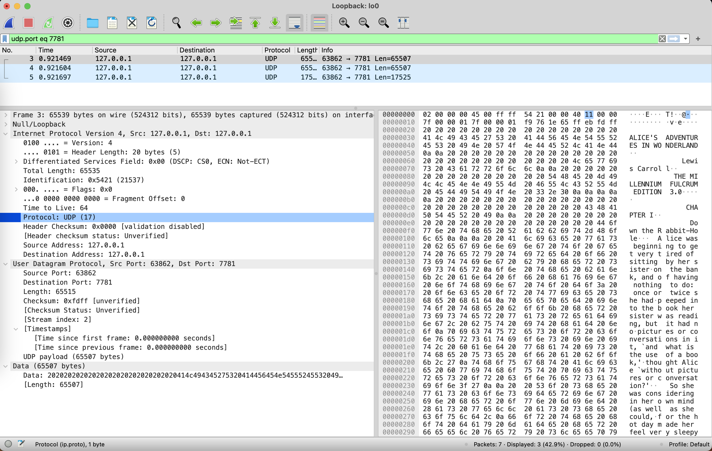
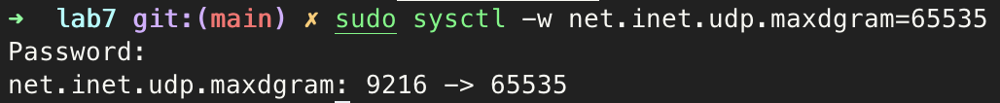

# Practice 7.1

[udp_server.py](udp_server.py)

```python
from socket import *

conn = socket(AF_INET,SOCK_DGRAM)
conn.bind(("", 7781))
while True:
    receiveData = conn.recvfrom(65507)

conn.close()
```

[udp_client.py](udp_client.py)

```python
from socket import *

step = 65507
conn = socket(AF_INET, SOCK_DGRAM)
data = open('alice.txt', 'r').read()
segment = [data[i:i + step] for i in range(0, len(data), step)]
for d in segment:
    conn.sendto(d.encode(),("", 7781))

conn.close()
```



**Q: **how many fields are there in the UDP header?

**A:** 4 fields.

**Q:** what are the name and value of each field in the UDP header.

**A:** Source port, destination port, length and checksum.

**Q:** the length (in bytes) of each fields in the UDP header.

**A:** 2 bytes.

**Q:** What is the maximum number of bytes of a UDP packet ?

**A:** Theoretically 65535 - 28 = 65507 bytes, but my system limits it to 9216 bytes, which can be changed



**Q:** What is the largest possible destination port number?

**A:** 65535. Since the fields only have 2 bytes = 16 bits = $2^{16}$ 

**Q:** What is the protocol ID for UDP in IP protocol?

**A:** Hex: `0x11`   Dec: `17`

# Practice 7.2

**Q:** What is the sequence number of the TCP SYN segment that is used to initiate the TCP connection between the client computer and gaia.cs.umass.edu? What is it in the segment that identifies the segment as a SYN segment?

**A:** seq=0; Flags=0x002

**Q:** What is the sequence number of the SYNACK segment sent by gaia.cs.umass.edu to the client computer in reply to the SYN? What is the value of the Acknowledgement field in the SYNACK segment? How did gaia.cs.umass.edu determine that value? What is it in the segment that identifies the segment as a SYNACK segment?

**A:** seq=0; ack=1; ack = seq + 1; Flags=0x012

**Q:** What is the sequence number of the TCP segment containing the HTTP POST command? Note that in order to find the POST command, you’ll need to dig into the packet content field at the bottom of the Wireshark window, looking for a segment with a “POST” within its DATA field.

**A:** seq=1 & seq=566

**Q:** Consider the TCP segment containing the HTTP POST as the first segment in the TCP connection. What are the sequence numbers of the first six segments in the TCP connection (including the segment containing the HTTP POST)? At what time was each segment sent? When was the ACK for each segment received? Given the difference between when each TCP segment was sent, and when its acknowledgement was received, what is the RTT value for each of the six segments? What is the EstimatedRTT value (see Section 3.5.3, page 242 in text) after the receipt of each ACK? Assume that the value of the EstimatedRTT is equal to the measured RTT for the first segment, and then is computed using the EstimatedRTT equation on page 242 for all subsequent segments.

**A:** 

- seq=1: Sent = 0.026477s, ACK = 0.053937s, RTT = 0.02746s
- seq=556: Sent = 0.041737s, ACK = 0.077294s, RTT = 0.035557s
- seq=2026: Sent = 0.054026s, ACK = 0.124085s, RTT = 0.070059s
- seq=3486: Sent = 0.054690s, ACK = 0.169118s, RTT = 0.11443s
- seq=4946: Sent = 0.070059s, ACK = 0.217299s, RTT = 0.13989s
- seq=6406: Sent = 0.077405s, ACK = 0.267802s, RTT = 0.18964s

**Q:**  What is the minimum amount of available buffer space advertised at the received for the entire trace? Does the lack of receiver buffer space ever throttle the sender?

**A:** 5840 bytes. No

**Q:** Are there any retransmitted segments in the trace file? What did you check for (in the trace) in order to answer this question?

**A:** No. `tcp.analysis.retransmission`

**Q:** What is the throughput (bytes transferred per unit time) for the TCP connection? Explain how you calculated this value.

**A:** $168856$ / $5.651$ sec = 30093.74 bytes / s

