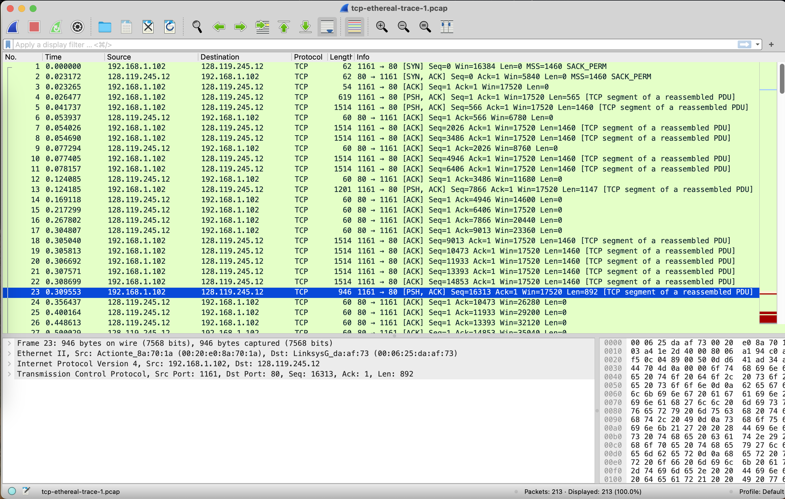
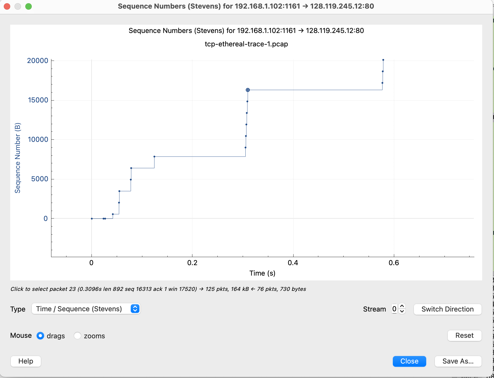

# Practice 8.1

**Q:** Use the *Time-Sequence-Graph(Stevens*) plotting tool to view the sequence number versus time plot of segments being sent from the client to the gaia.cs.umass.edu server. Can you identify where TCP’s slowstart phase begins and ends, and where congestion avoidance takes over? Comment on ways in which the measured data differs from the idealized behavior of TCP that we’ve studied in the text.

**A: **The slowstart began after the three way handshake and ended when congestion window size stopped increasing but we can't identify from the graph. And when cwnd did not longer increase (starting from frame 14 and ending with fram 29), congestion avoidance takes over.

