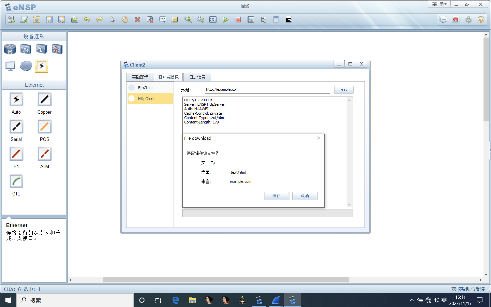
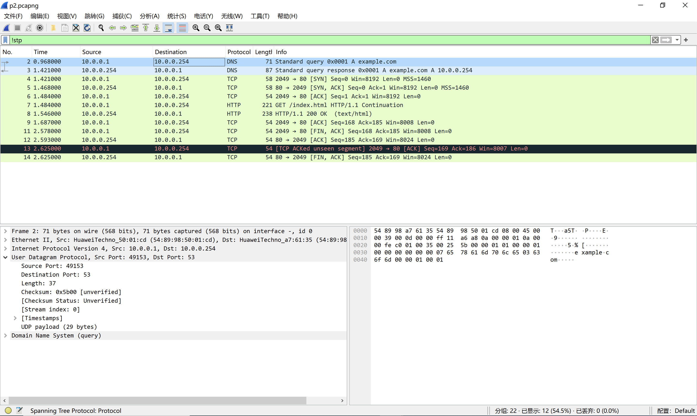
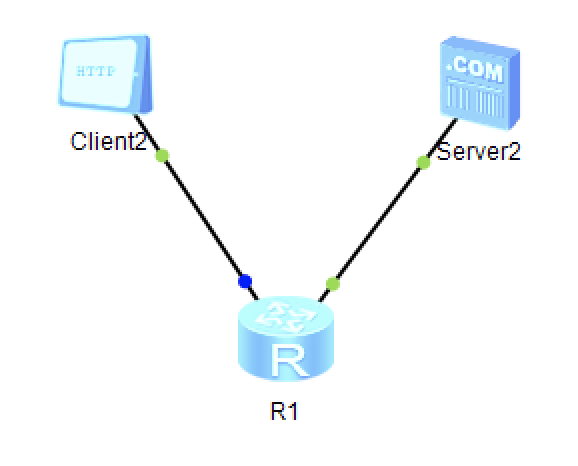
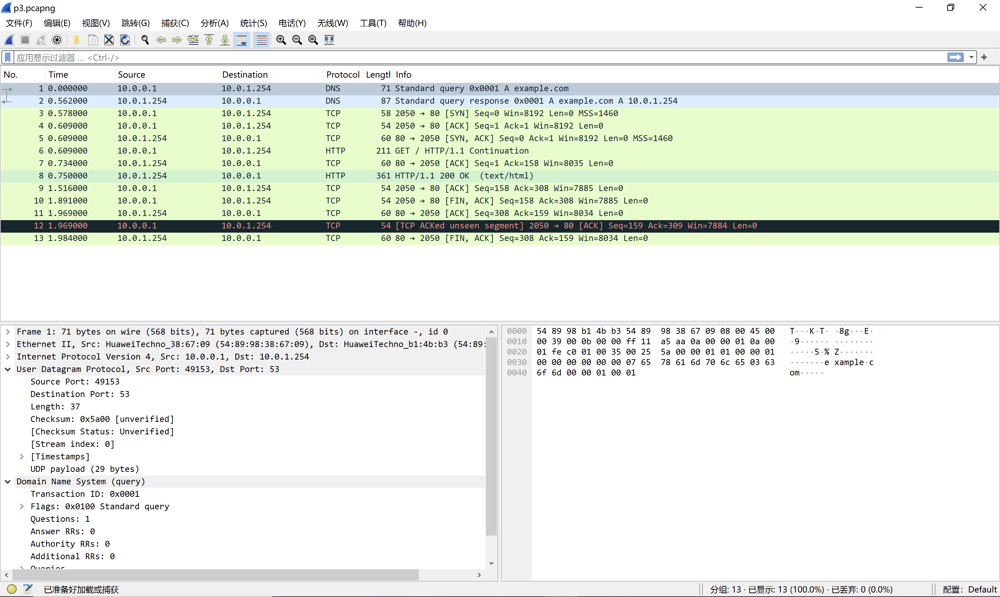

# Practice 9.1

It works

# Practice 9.2

**Q:** What's the port number of DNS server?

**A:** `53`

**Q:** Is there any TCP session such as TCP handshake and farewell?

**A:** Yes, as the figure indicates.

**Q:** In DNS session and HTTP session, are the ports of client same or not?

**A:** Different. DNS: `49153` and TCP: `2049`.

# Practice 9.3

**Q:** What's the port number of DNS server?

**A:** `53`

**Q:** Is there any TCP session such as TCP handshake and farewell?

**A:** Yes, as the figure indicates.

**Q:** In DNS session and HTTP session, are the ports of client same or not?

**A:** Different. DNS: `49153` and TCP: `2050`.
